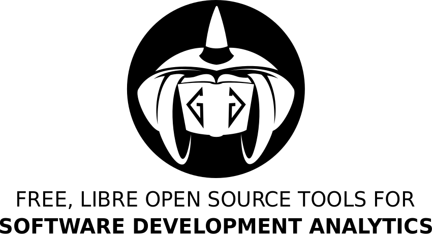
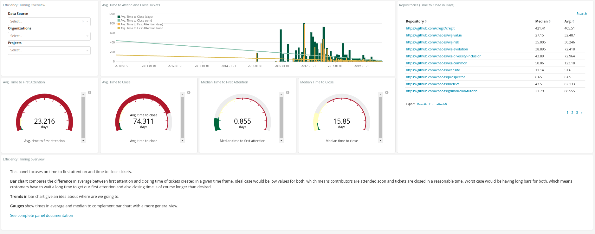

# GrimoireLab

[GrimoireLab](http://grimoirelab.github.io/) is free, open source software for software development analytics. It is part of [CHAOSS](http://chaoss.community),
a project under the Linux Foundation umbrella which develops metrics, methodologies, and software for expressing open source project health and sustainability. 

GrimoireLab is able to retrieve data from more than 30 different data sources, which are tools and platforms used in software development. The data obtained is then
automatically processed and finally visualized through either static reports and dynamic dashboards. 

## Supported data sources
GrimoireLab supports many types of data sources, from data retrieval to analytics and visualization. The data sources are listed below:

- **Version control systems:** Git
- **Source code review systems:** Gerrit, GitHub, GitLab
- **Bugs/Ticketing tools:** Bugzilla, GitHub, GitLab, Jira, Launchpad, Phabricator, Redmine
- **Mailing:** Hyperkitty, Mbox, Pipermail, Groupsio
- **News:** Rss, Nntp
- **Instant messaging:** Slack, Mattermost, Supybot, Telegram
- **Q/A:** Askbot, Discourse, StackExchange
- **Documentation:** Confluence, Mediawiki
- **Deployment**: DockerHub
- **Continous integration**: Jenkins
- **Search engines**: GoogleHits
- **Social networks**: Meetup, Twitter
- **Others**: Crates, Kitsune, Mozillaclub, Remo, Puppetforge, Functest, CSV

## Dashboards
The dashboards allow to interactively drill down, inspect and focus on specific facets of your software project. They target three main axis: community, activity and processes, which
grant GrimoireLab users with proper means to understand their projects and take informed decisions. You can see an example of the Grimoirelab dashboards at https://chaoss.biterg.io, which
is used to the CHAOSS project. 

### Community
The community axis shows insights at contributors and organizations level, for instance it is easy to know the contributors' growth curve and the attraction and retention evolution as well as 
the organizations working on the project and how their contributions are distributed.

ADD EXAMPLE WITH CHAOSS DASHBOARD

### Activity
The activity axis gives insights about the volume of contributions. Examples of activities are the number of issues open and closed, the number of commits and  (e.g., issues, commits, pull requests)

ADD EXAMPLE WITH CHAOSS DASHBOARD

### Processes
The processes axis measures the agility of the project. Examples of processes are the time to resolve issues, merge pull requests, time to first answers.
The figure below shows one of the GrimoireLab dashboards of the CHAOSS project. As can be seen, the dashboard provides statistics about the time to first attention and time to close
issues. Furthermore, it provides selectors to filter a sub-set of CHAOSS repositories.
 
