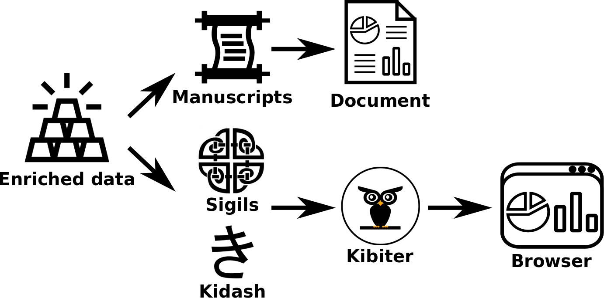

# Overview

The overall structure of GrimoireLab is summarized in the figure below. Its core is composed of four components that take care of: extracting software development data, storing it, managing contributor identities and analyzing (visualizing) the data obtained. Additionally, orchestration of all the components is also available. The details of each component are described in the next sections.

*Overview of GrimoireLab. Software data is extracted, processed and visualized via four components, with one of them dedicated to managing identities. A further component allows to perform analysis over a set of target data sources by setting up and orchestrating together the other components.*
## Data retrieval

Data retrieval is handled by three tools. 

- [Perceval](https://github.com/chaoss/grimoirelab-perceval) is designed to deal only with fetching the data, so that it can be optimized for that task. Usually, it works as a library, providing a uniform Python API to access software development repositories. 

- [Graal](https://github.com/chaoss/grimoirelab-graal) complements Perceval by collecting data from the source code of Git repositories. It provides a mechanism to plug in third party source code analysis tools and libraries.

- [King Arthur](https://github.com/chaoss/grimoirelab-kingarthur) schedules and runs Perceval and Graal executions at scale through distributed queues.

## Identities management

Identity management is a component that handles contributors information and enables analysis where identities, organizations and affiliations are first-class citizens.

Depending on the kind of repository from which the data is retrieved, identities can come in different formats: commit signatures (e.g., full names and email addresses) in Git repositories, email addresses, GitHub or Slack usernames, etc. Furthermore, a given person may use several identities even in the same data source, and in different kinds of data sources. In some cases, an identity can be shared by several contributors (e.g., support email addresses in forums).

SortingHat and Hatstall are the tools used in GrimoireLab for managing identities. 

- [Sortinghat](https://github.com/chaoss/grimoirelab-sortinghat) maintains a relational database with identities and related information, including the origin of each identity, for traceability. In the usual pipeline, the data storage component feeds SortingHat with identities found in data sources. SortingHat uses heuristics-based algorithms to merge identities data, and sends the unified data back to the data storage component.
- [HatStall](https://github.com/chaoss/grimoirelab-hatstall) is a web application, which provides an intuitive graphical interface to perform operations over a SortingHat database.

## Data storage

GrimoireLab pipelines usually involve storing the retrieved data, with two main goals: allowing for repeating analysis without needing new data retrieval, and having pre-processed data available, suitable for visualization and analytics. For the first goal, a raw database is maintained, with a copy of all JSON documents produced by Perceval. For the second, an enriched database, which is a flattened summary of the raw documents, is produced and stored.

[ELK](https://github.com/chaoss/grimoirelab-elk) is the tool interacting with the database. The design underlying ELK (shown below) consists of a feeder that collects the JSON documents produced by the data retrieval component. Next, the documents are stored as the raw database. Dumps of this raw data can be easily created to make any analysis reproducible, or just to conveniently perform the analytics with other technologies beyond the ones provided by GrimoireLab.

Then, the raw data is enriched by including identities information and attributes not directly available in the original data. For example, pair programming information is added to Git data, when it can be extracted from commit messages, or time to solve (i.e., close or merge) an issue or a pull request is added to the GitHub data. The data obtained is finally stored as flat JSON documents, embedding references to the raw documents for traceability.

*Overview of ELK. The Perceval JSON documents are stored as they are into a No-SQL database to allow multiple analysis without retrieving data over and over. The stored data is then enriched with additional information and stored separately, its format can be consumed by the analytics component.*

## Analytics

The analytics component is in charge of presenting the data via static reports and dynamic dashboards. The tools participating in the generation of such artifacts are highlighted in the figure below and described below.

*Overview of Analytics component, which allows to create static informative reports and interactive web-based dashboards.*

- **Reports** are generated by [Manuscripts](https://github.com/chaoss/grimoirelab-manuscripts), a tool that queries the GrimoireLab data storage and produces template-based documents, which ready to be delivered to decision-makers, able in this way to easily identify relevant aspects of their projects.

- **Dashboards** creation involve three tools:

  - [Sigils](https://github.com/chaoss/grimoirelab-sigils) is a set of predefined widgets (e.g., visualizations and charts) available as JSON documents.
  
  - [Kidash](https://github.com/chaoss/grimoirelab-kidash) is a tool able to import and export widgets to Kibiter.
  
  - [Kibiter](https://github.com/chaoss/grimoirelab-kibiter) is a downstream of [Kibana](https://github.com/elastic/kibana) which performs the binding between the Sigils widgets and the GrimoireLab data, thus providing web-based dashboards for actionable inspection, drill down, and filtering of the software development data retrieved.

## Orchestration

The orchestration component takes care of coordinating the process leading to the dashboards.

[SirMordred](https://github.com/chaoss/grimoirelab-sirmordred) is the tool which enables the user to easily run GrimoireLab to retrieve data from software repositories, produce raw and enriched data, load predefined widgets and generate dashboards.

SirMordred relies on the `setup.cfg` and `projects.json` files, which have been designed to keep separated sensitive data from the one that can be publicly shared. Thus, the setup file includes credentials and tokens to access the GrimoireLab components and software repositories, while the projects file includes the information about the projects to analyse. Both files are
described below.

- `Setup.cfg` holds the configuration to arrange all process underlying GrimoireLab. It composed of sections which allow to define the general settings such as which components activate and where to store the logs, as well as the location and credentials 
for ELK, SortingHat and Kibiter which can be protected to prevent undesired accesses. Furthermore, it also includes other sections to set up the parameters used by the data retrieval component to access the software repositories (e.g., GitHub tokens, gerrit username) and fetch their data.

- `Projects.json` enables the users to list the projects to analyse, divided by data sources such Git repositories, GitHub and GitLab issue trackers and Slack channels.
Furthermore, it also allows to add some meta information to group projects together, which structure is reflected in the dashboards.