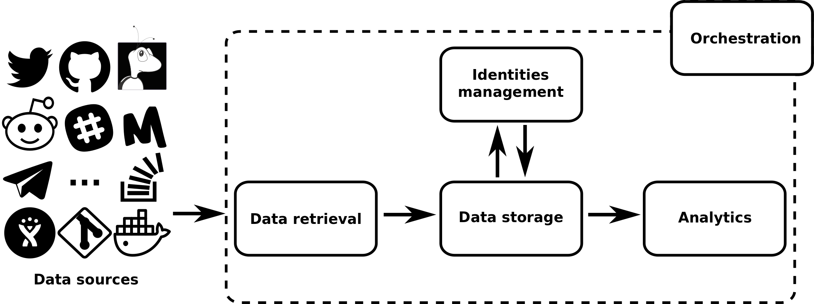

# Overview

The overall structure of GrimoireLab is summarized in the figure below. Its core is composed of four tasks: extracting software development data, storing it, managing contributor identities and analyzing (visualizing) the data obtained. Additionally, orchestration of all the tasks is also available. The details of each of the tasks are described in the next sections.

Overview of GrimoireLab. Software data is extracted, processed and visualized via four components, with one of them dedicated to managing identities. A further component allows to perform analysis over a set of target data sources by setting up and orchestrating together the other components.

## Data retrieval

Data retrieval is handled by three components. 

- [Perceval](https://github.com/chaoss/grimoirelab-perceval) is designed to deal only with fetching the data, so that it can be optimized for that task. Usually, it works as a library, providing a uniform Python API to access software development repositories. 

- [Graal](https://github.com/chaoss/grimoirelab-graal) complements Perceval by collecting data from the source code of Git repositories. It provides a mechanism to plug in third party source code analysis tools and libraries.

- [King Arthur](https://github.com/chaoss/grimoirelab-kingarthur) schedules and runs Perceval and Graal executions at scale through distributed queues.

## Identities management

TODO

## Data storage

TODO

## Analytics

TODO

## Orchestration

TODO