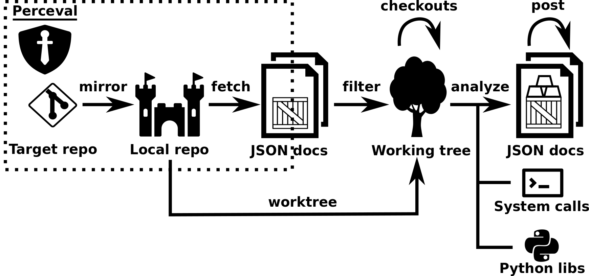

## Graal

Graal complements the data extracted with Perceval by providing insights about the source code (e.g, code complexity, licenses).

Graal leverages on the incremental functionalities provided by Perceval and enhances the logic to handle Git repositories
to process their source code. The overall view of Graal and its connection with Perceval is summarized in the figure below: the Git backend creates a local mirror of a Git repository (local or
remote) and fetches its commits in chronological order. Several parameters are available to control the execution; for instance, *from_date* and *to_date* allow to select commits authored since
and before a given date, *branches* allows to fetch commits only from specific branches, and *latest_items* returns only those commits which are new since the last fetch operation.

Graal extends the Git backend by enabling the creation of a working tree (and its pruning), that allows to perform checkout operations which are not possible on a Git mirror. Furthermore,
it also includes additional parameters used to drive the analysis to filter in/out files and directories in the repository (*in_paths* and *out_paths*), set the *entrypoint* and define the *details* level
of the analysis (useful when analyzing large software projects).


*Overview of Graal*

Following the philosophy of Perceval, the output of the Git backend execution is a list of JSON documents (one per
commit). Therefore, Graal intercepts each document, replaces some metadata information (e.g., backend name, category) and
enables the user to perform the following steps: (i) filter, (ii)
analyze and (iii) post-process, which are described below.

- **Filter.**
    The filtering is used to select or discard commits based on the information available in the JSON document
    and/or via the Graal parameters (e.g., the commits authored by a given user or targeting a given software component).
    For any selected commit, Graal executes a checkout on the working tree using the commit hash, thus setting the state of
    the working tree at that given revision. The filtering default built-in behavior consists in selecting all commits.

- **Analyze.**
    The analysis takes the document and the current working tree and enables the user to set up an ad-hoc
    source code analysis by plugging existing tools through system calls or their Python interfaces, when possible. The results of
    the analysis are parsed and manipulated by the user and then automatically embedded in the JSON document. In this step,
    the user can rely on some predefined functionalities of Graal to deal with the repository snapshot (e.g., listing files, creating
    archives). By default, this step does not perform any analysis, thus the input document is returned as it is.

- **Post-process.**
    In the final step, the inflated JSON document can be optionally processed to alter (e.g., renaming, removing) its attributes, thus granting the user complete control 
    over the output of Graal executions. The built-in behavior of this step keeps all attributes as they are.
 
### Backends
Several backends have been developed to assess the genericity of Graal. Those backends leverage on source code analysis
tools, where executions are triggered via system calls or their Python interfaces. In the current status, the backends
mostly target Python code, however other backends can be easily developed to cover other programming languages. The
currently available backends are:
- **CoCom** gathers data about code complexity (e.g., cyclomatic complexity, LOC) from projects written in popular programming languages such as: C/C++, Java, Scala, JavaScript, Ruby, Python, Lua and Golang. It leverages on [Cloc](http://cloc.sourceforge.net/) and [Lizard](https://github.com/terryyin/lizard). The tool can be exectued at `file` and `repository` levels activated with the help of category: `code_complexity_lizard_file` or `code_complexity_lizard_repository`.
- **CoDep** extracts package and class dependencies of a Python module and serialized them as JSON structures, composed of edges and nodes, thus easing the bridging with front-end technologies for graph visualizations. It combines [PyReverse](https://pypi.org/project/pyreverse/) and [NetworkX](https://networkx.github.io/).
- **CoQua** retrieves code quality insights, such as checks about line-code’s length, well-formed variable names, unused imported modules and code clones. It uses [PyLint](https://www.pylint.org/) and [Flake8](http://flake8.pycqa.org/en/latest/index.html). The tools can be activated by passing the corresponding category: `code_quality_pylint` or `code_quality_flake8`.
- **CoVuln** scans the code to identify security vulnerabilities such as potential SQL and Shell injections, hard-coded passwords and weak cryptographic key size. It relies on [Bandit](https://github.com/PyCQA/bandit).
- **CoLic** scans the code to extract license & copyright information. It currently supports [Nomos](https://github.com/fossology/fossology/tree/master/src/nomos) and [ScanCode](https://github.com/nexB/scancode-toolkit). They can be activated by passing the corresponding category: `code_license_nomos`, `code_license_scancode`, or `code_license_scancode_cli`.
- **CoLang** gathers insights about code language distribution of a git repository. It relies on [Linguist](https://github.com/github/linguist) and [Cloc](http://cloc.sourceforge.net/) tools. They can be activated by passing the corresponding category: `code_language_linguist` or `code_language_cloc`.

## Graal in action
This section describes how to install and use Graal, highlighting its main features.

### Installation

Graal is being developed and tested mainly on GNU/Linux platforms. Thus it is very likely it will work out of the box
on any Linux-like (or Unix-like) platform, upon providing the right version of Python. The listing below shows how to install and uninstall Graal on your system. Currently, the only way of installing Graal consists of cloning the GitHub repository
hosting the [tool](https://github.com/chaoss/grimoirelab-graal) and using the setup script, while uninstalling the tool can be easily achieved by relying on *pip*.

```bash
To install, run:
git clone https://github.com/valeriocos/graal
python3 setup.py build
python3 setup.py install
To uninstall, run:
pip3 uninstall graal
```

### Use

Once installed, Graal can be used as a stand-alone program or Python library. We showcase these two types of executions below.

#### Stand-alone program
Using Graal as stand-alone program does not require much effort, but only some basic knowledge of GNU/Linux shell commands. The listing below shows
how easy it is to fetch code complexity information from a Git repository. As can be seen, the CoCom backend requires the URL where the repository is located (https://github.com/chaoss/grimoirelab-perceval) and the local path where to
mirror the repository (/tmp/graal-cocom). Then, the JSON documents produced are redirected to the file graal-cocom.test. The remaining messages in the listing are prompted to the user
during the execution. 

Interesting optional arguments are *from-date*, which is inherited from Perceval and allows to fetch commits from a given date, *worktree-path* which sets the path of the working tree,
and *details* which enables fine-grained analysis by returning complexity information for methods/functions.

```bash
graal cocom https://github.com/chaoss/grimoirelab-perceval --git-path /tmp/graal-cocom > /graal-cocom.test
[2018-05-30 18:22:35,643] - Starting the quest for the Graal.
[2018-05-30 18:22:39,958] - Git worktree /tmp/... created!
[2018-05-30 18:22:39,959] - Fetching commits: ...
[2018-05-31 04:51:56,111] - Git worktree /tmp/... deleted!
[2018-05-31 04:51:56,112] - Fetch process completed: ...
[2018-05-31 04:51:56,112] - Quest completed.
```

#### Python Library
Graal’s functionalities can be embedded in Python scripts. Again, the effort of using Graal is minimum. In this case the user only needs some knowledge of Python
scripting. The listing below shows how to use Graal in a script. The graal.backends.core.cocom module is imported at the beginning of the file, then the repo uri and repo dir variables
are set to the URI of the Git repository and the local path where to mirror it. These variables are used to initialize a CoCom class object. In the last line of the script, the commits
inflated with the result of the analysis are retrieved using the fetch method. The fetch method inherits its argument from Perceval, thus it optionally accepts two Datetime objects to
gather only those commits after and before a given date, a list of branches to focus on specific development activities, and a flag to collect the commits available after the last execution.

```python
#! /usr/bin/env python3
from graal.backends.core.cocom import CoCom

# URL for the git repo to analyze
repo_uri = ’http://github.com/chaoss/grimoirelab-perceval’
# directory where to mirror the repo
repo_dir = ’/tmp/graal-cocom’

# Cocom object initialization
cc = CoCom(uri=repo_url, gitpath=repo_dir)
# fetch all commits
commits = [commit for commit in cc.fetch()]
```

## Example
ADD CONTENT FROM https://chaoss.github.io/grimoirelab-tutorial/graal/cocom.html