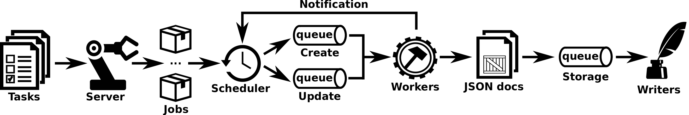

# King Arthur

Originally, King Arthur (or just Arthur) was designed to allow to schedule and run Perceval executions at scale through distributed Redis queues, and store the obtained results in an ElasticSearch database, thus giving the possibility to
connect the results with analysis and/or visualizations tools. The figure below highlights the overall view of Arthur. 



*Overview of Arthur*

At its heart there are two components: the server and one or more instances of workers, in charge of running Perceval executions. The server waits for HTTP requests, which allow to add,
delete or list tasks using REST API commands (i.e., add, remove, tasks). The listing below depicts how to send commands to the Arthur server. As can be seen, adding and removing tasks
requires specific parameters, sent as JSON data within the request. Adding a task needs a JSON object that contains a task id (useful for deleting and listing operations), the
parameters needed to execute a Perceval backend, plus other optional parameters to control the scheduling (i.e., delayed start, maximum number of retries upon failures) and archive
the fetched data. Conversely, in order to remove a task, the JSON object must contain the identifier of that given task.

```bash
# Adding tasks
$ curl -H "Content-Type: application/json" --data @to_add.json http://127.0.0.1:8080/add

# Removing tasks
$ curl -H "Content-Type: application/json" --data @to_remove.json http://127.0.0.1:8080/remove

# Listing tasks
$ curl http://127.0.0.1:8080/tasks
```

After receiving a task, the server initializes a job with the task parameters, thus enabling a link between the job and the task, and sends the job to the scheduler. The scheduler
manages two (in-memory) queues handling first-time jobs and already finished jobs that will be rescheduled. The former are Perceval executions that perform the initial gathering from
a data source, while the latter are executions launched in incremental mode (e.g., from a given date, which is by default the date when the previous execution ended). In case of
execution failures, the job is rescheduled as many times as defined in the scheduling parameters of the task.

Workers grant Arthur with scalability support. They listen to the queues, pick up jobs and run Perceval backends. Once the latter have finished, workers notify the scheduler with the result of the execution, and in case of success, they send the
JSON documents to the server storage queue. Such documents are consumed by writers, which make possible to live-stream data or serialize it to database management systems. In the
current implementation, Arthur can store the JSON documents to an ElasticSearch database.

## Executing Graal through Arthur
Arthur has been extended to allow handling Graal tasks, which inherit from Perceval Git tasks, thus Arthur periodically executes the method fetch of a given Graal backend. Optionally, the parameter latest items can be used to run the analysis
only on the new commits available after the last execution.

The listings below show two examples of JSON objects to include and delete Graal tasks. As can be seen, adding a task to analyze the code complexity of a repository consists of sending an add
command to the Arthur server with a JSON object including a task id (*cocom_graal*), the parameters needed to execute an instance of the CoCom backend, such as its category (i.e.,
code complexity), the URI of the target repository and the local path where it will be mirrored (i.e., *uri* and *git_path*).

Furthermore, the task defines also the scheduler settings delay and max retries, which allow to postpone the scheduling of the corresponding job and set the maximum number of retries upon job failures before raising an exception 12 . Deleting the
cocom graal task requires less effort, it suffices to send a remove command to the Arthur server that includes a JSON object with the target task.

```json
{
    "tasks": [
        {
            "task_id": "arthur.git",
            "backend": "git",
            "backend_args": {
                "gitpath": "/tmp/git/arthur.git/",
                "uri": "https://github.com/chaoss/grimoirelab-kingarthur.git",
                "from_date": "2015-03-01"
            },
            "category": "commit",
            "scheduler": {
                "delay": 10
            }
        },
        {
            "task_id": "bugzilla_mozilla",
            "backend": "bugzillarest",
            "backend_args": {
                "url": "https://bugzilla.mozilla.org/",
                "from_date": "2016-09-19"
            },
            "category": "bug",
            "archive": {
                "fetch_from_archive": true,
                "archived_after": "2018-02-26 09:00"
            },
            "scheduler": {
                "delay": 60,
                "max_retries": 5
            }
        }
    ]
}
``` 
*Adding a Graal task*

```json
{
    "tasks": [
        {
            "task_id": "bugzilla_mozilla"
        },
        {
            "task_id": "arthur.git"
        }
    ]
}
```
*Removing a Graal task*
