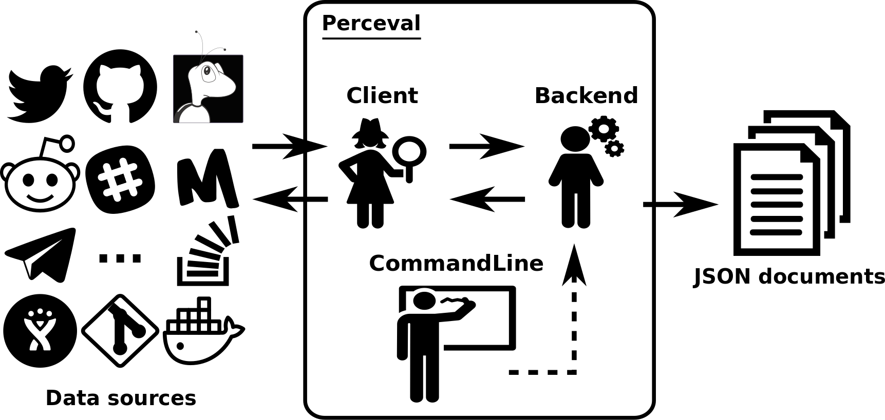

## Perceval

Perceval was designed with a principle in mind: do one thing and do it well. Its goal is to fetch data from data source repositories efficiently. It does not store nor analyze data, leaving these tasks to other, specific tools. Though it was conceived as a command line tool, it may be used as a Python library as well.
Perceval supports plenty of data sources, which are commonly used to support, coordinate and promote development activities, such as Git, GitHub, GitLab, Slack and so on.

A common execution of Perceval consists of fetching a collection of homogeneous items from a given data source. For instance, issue reports are the items extracted from Bugzilla and GitHub
issues trackers, while commits and code reviews are items obtained from Git and Gerrit repositories. Each item is inflated with item-related information (e.g., comments and authors of a GitHub issue)
and metadata useful for debugging (e.g., backend version and timestamp of the execution). The output of the execution is a list of JSON documents (one per item).

The overall view of Perceval’s approach is summarized in the figure below. At its heart there are three components: **Backend**, **Client** and **CommandLine**.



*Overview of the approach. The user interacts with the backend through the shell command line, which depending on the data source retrieves with a specific client the data; the output is provided in form of JSON documents.*

### Backend

The Backend orchestrates the gathering process for a specific data source and puts in place incremental and caching mechanisms. Backends share common features, such as incrementality and caching, and define also specific ones tailored to the data source they are targeting. For instance, the GitHub backend requires an API token and the names of the repository and owner; instead the StackExchange backend needs an API token plus the tag to filter questions.

### Client

The backend delegates the complexities to query the data source to the Client. Similarly to backends, clients share common features such as handling possible connection problems with remote data sources, and define specific ones when needed. For instance, long lists of results fetched from GitHub and StackExchange APIs are delivered in pages (e.g., pagination), thus the corresponding clients have to take care of this technicality.

### CommandLine

The CommandLine allows to set up the parameters controlling the features of a given backend. Furthermore, it also provides optional arguments such as help and debug to list the backend features and enable debug mode execution, respectively.

## Perceval in action

This section describes how to install and use Perceval, highlighting its main features.

### Installation

Perceval is being developed and tested mainly on GNU/Linux platforms. Thus, it is very likely it will work out of the box on
any Linux-like (or Unix-like) platform, upon providing the right version of Python available.

There are several ways for installing Perceval on your system: with the [pip packager manager](https://pypi.org/project/perceval/), from a [Docker image](https://github.com/chaoss/grimoirelab-perceval/tree/master/docker/images) or from the
source code. The listing below shows how to install Perceval from pip and source code. Further installation information can be found on [GitHub](https://github.com/grimoirelab/perceval).

```bash
# Installation through pip
$ pip3 install perceval
-------------------------------------------------------
# Installation from source code
$ git clone https :// github . com / grimoirelab / perceval . git
$ pip3 install -r requirements . txt
$ python3 setup . py install
```

### Use

Once installed, a Perceval backend can be used as a stand-alone program or Python library. We showcase these two types of executions by fetching data from a Git repository.

Git is probably the most popular source code management system nowadays. Is is usually used to track versions of source code files. Transactions on a Git repositories are called commits. Each
commit is an atomic change to the files in the repository. For each commit, Git maintains data for tracking what changed, and some metadata such as who committed the change, when and which files
were affected.

Perceval clones the Git repository to analyze, and gets information for all its commits by using the git log command under the hoods. It produces a JSON document (a dictionary when using
it from Python) for each commit. The listing below shows an excerpt of a JSON document produced. As can be seen, the document contains some item-related information (e.g., files) plus metadata included by Perceval itself (e.g., backend_name, backend_version).

```json
{
    "backend_name": "Git",
    "backend_version": "0.12.0",
    "category": "commit",
    "classified_fields_filtered": null,
    "data": {
        "Author": "Santiago Due\u00f1as <sduenas@bitergia.com>",
        "AuthorDate": "Fri Jul 19 13:42:49 2019 +0200",
        "Commit": "Santiago Due\u00f1as <sduenas@bitergia.com>",
        "CommitDate": "Fri Jul 19 13:42:49 2019 +0200",
        "commit": "dd5f1dce4a37a7941a96a1acc5ec95bf151393c5",
        "files": [
            {
                "action": "M",
                "added": "1",
                "file": "grimoirelab_toolkit/_version.py",
                "indexes": [
                    "390ac0c",
                    "ddbba5f"
                ],
                "modes": [
                    "100644",
                    "100644"
                ],
                "removed": "1"
            }
        ],
        "message": "Update version number to 0.1.10",
        "parents": [
            "9aae92e72f2098f54b5ad572710e8d2dc46ddf49"
        ],
        "refs": [
            "HEAD -> refs/heads/master"
        ]
    },
    "origin": "https://github.com/chaoss/grimoirelab-toolkit",
    "perceval_version": "0.12.23",
    "search_fields": {
        "item_id": "dd5f1dce4a37a7941a96a1acc5ec95bf151393c5"
    },
    "tag": "https://github.com/chaoss/grimoirelab-toolkit",
    "timestamp": 1570886107.24431,
    "updated_on": 1563536569.0,
    "uuid": "16afbc524d682f4fca498a64fbaf9a7d3690b254"
}
```

#### Stand-alone program

Using Perceval as stand-alone program does not require much effort, but only some basic knowledge of GNU/Linux shell commands. The listing below shows how easy it is to
fetch commit information from a Git repository. As can be seen, the backend for Git requires the URL where the repository is located (https:// github.com/ grimoirelab/ perceval.git), then the JSON
documents produced are redirected to the file perceval.test. The remaining messages in the listing are prompted to the user during
the execution.

One interesting optional argument is from-date, which allows to fetch commits from a given date, thus showing an example of how incremental support is easily achieved in Perceval.

```bash
$ perceval git https://github.com/grimoirelab/perceval > /perceval.test
[2017-11-18 20:32:19 ,425] - Sir Perceval is on his quest.
[2017-11-18 20:32:19 ,427] - Fetching commits: 'https://github.com/grimoirelab/perceval' git repository from 1970-01-01 00:00:00+00:00; all branches
[2017-11-18 20:32:20 ,798] - Fetch process completed: 798 commits fetched
[2017-11-18 20:32:20 ,798] - Sir Perceval completed his quest.
```

#### Python library

Perceval’s functionalities can be embedded in Python scripts. Again, the effort of using Perceval is minimum. In this case the user only needs some knowledge of Python scripting.

The listing below shows how to use Perceval in a script. The perceval.backends module is imported at the beginning of the file, then the repo_url and repo_dir variables are set to the URL of the Git
repository and the local path where to clone it. These variables are used to initialize an object of the perceval.backends.git.Git class. In the last two lines of the script, the commits are retrieved using
the method fetch and the names of their authors printed. The fetch method, which is available in all backends, needs to be tailored to the target data source. Therefore, the Git backend fetches commits,
while GitHub and StackExchange ones fetch issues and questions. The fetch method optionally accepts a Datetime object to gather only those items in the data source modified after a given date.
When possible, the filtering of the items relies on the data source functionalities, for instance the GitHub API allows to ask for issues modified after a date. In the other cases, the filtering is implemented
in the backend itself.

```python
#!/usr/bin/env python3
from perceval.backends.core.git import Git

# URL for the git repo to analyze
repo_url = 'http://github.com/grimoirelab/perceval'
# directory for letting Perceval clone the git repo
repo_dir = '/tmp/perceval.git'

# Git object , pointing to repo_url and repo_dir for cloning
repo = Git (uri=repo_url, gitpath=repo_dir)

# fetch all commits and print each author
for commit in repo.fetch():
    print(commit['data']['Author'])
```

## Examples

### GitHub
GitHub is a popular service for hosting software development. It provides git repositories associated with issues (tickets) and pull requests (proposed patches). All this information is available via the GitHub API. We will use Perceval GitHub backend to retrieve data from this API for issues and pull requests. For git repositories we can use the Perceval git backend, as we already introduced in the previous section.
ADD CONTENT FROM https://chaoss.github.io/grimoirelab-tutorial/perceval/github.html

### Mail archives
TODO

