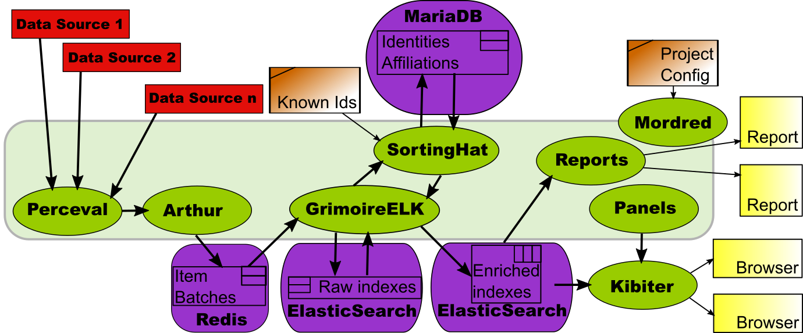

## Components

GrimoireLab is a platform for making it easy to apply analytics on data related to software development. It provides components for:

* Automatic and incremental data retrieval from software development support systems (data sources). Those include source code management, issue tracking, communication, testing, code review systems, among others.
* Automatic organization and enrichment of retrieved data, so that it can be analyzed more easily.
* Management of different identities for the same person, and other data related to persons, such as affiliation to companies.
* Visualization of the data in actionable dashboards.
* Production of reports about specific aspects of software development processes.

Most of the components in GrimoireLab are written in Python, and provide Python APIs and standalone programs.

The main components of GrimoireLab are:

* **Perceval**. Includes components for retrieving data from data sources. All components provide an uniform API for accessing their data sources, based on Python generators and data dictionaries (JSON documents). [Learn more about Perceval](/perceval/intro.md).
* **Graal**. leverages on the Git backend of Perceval and enhances it to set up ad-hoc source code analysis. It fetches the commits from a Git repository and provides a mechanism to plug third-party tools/libraries focused on source code analysis. [Learn more about Graal](/graal/intro.md).
* **KingArthur**. Organizes the data retrieval from large collections of repositories of different kinds, providing a uniform API to all of them, and to the different retrieval jobs running in any moment. [Learn more about KingArthur](/basics/scenarios.md#arthur-orchestrating-data-retrieval).
* **GrimoireELK**. Collects data retrieved by Arthur, or directly by Perceval, and stores it in ElasticSearch indexes (raw indexes). It also organizes and transforms those raw indexes into other ElasticSearch indexes (enriched indexes), more suitable for visualization or reporting. [Learn more about GrimoireELK](/gelk/intro.md).
* **SortingHat**. Manages identities for persons, including capabilities for merging the many identities corresponding to the same person, and other data related to them (such as affiliation to companies). [Learn more about SortingHat](/grimoirelab-tutorial/sortinghat/data.md).
* **Kibiter**. Visualization platform. It is a soft fork of [Kibana](https://www.elastic.co/products/kibana), which allows for the construction of actionable dashboards to show the data in enriched indexes.
* **Sigils**. Definition of Kibiter dashboards. They encode the panels, visualizations and other details needed to produce dashboards in Kibiter or Kibana.  [Learn more about Sigils](https://github.com/chaoss/grimoirelab-sigils).
* **Manuscripts**. Production of PDF documents reporting on the main characteristics of a project. [Learn more about Manuscripts](/manuscripts/first.md).
* **Mordred**. Manages the configuration of all the components needed to produce a dashboard, automating its production. [Learn more about Mordred](/basics/scenarios.md).

In the figure above, GrimoireLab components are represented in the pale green box. Bold arrows show the main data flow: from data sources to Perceval (which retrieves them), to Arthur (which schedules retrieval batches and stores results in Redis), to GrimoireELK (which stores retrieved items as raw indexes, and then uses them to produce enriched indexes, both in ElasticSearch), to Reports (to produce specialized reports) or Kibiter (to visualize in actionable dashboards).

GrimoireELK uses SortingHat to store all the identities it finds in a MariaDB database. SortingHat uses lists of known identifiers (usually maintained in configuration files) and heuristics to merge identities corresponding to the same person, and related information (such as affiliation).

All the process is configured and orchestrated by Mordred, which uses its own configuration about, for example, which data sources to use.
