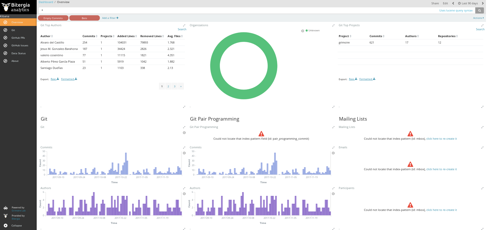

## Deploying from DockerHub

GrimoireLab can be found, already installed and ready to use, as Docker container images. The image which is likely most useful for a start is [grimoirelab/full](https://hub.docker.com/r/grimoirelab/full), available from DockerHub. It includes all GrimoireLab components, along with the services needed to produce a fully functional GrimoireLab dashboard: Elasticsearch, MariaDB, and Kibiter. By default, the container produces a dashboard for the GrimoireLab project.

For using these container images, ensure you have a recent version of `docker` installed, see [Docker installation instructions](https://docs.docker.com/engine/installation/)). The examples have been tested with 17.x in Debian GNU/Linux,

To try `grimoirelab/full`, just type:

```bash
docker run -p 127.0.0.1:5601:5601 \
    -v $(pwd)/credentials.cfg:/override.cfg \
    -t grimoirelab/full
```

`credentials.cfg` should have a GitHub API token, in  `mordred.cfg` format:

```
[github]
api-token = XXX
```

This will pull the `grimoirelab/full` Docker container image from DockerHub (if it is not already in the local host), and will run it. Upon running it, the container will launch Elasticsearch, MariaDB, and Kibana, so they will be ready when the container launches Mordred to retrieve data from GrimoireLab project repositories, and finally produce a complete dashboard for it.

The resulting dashboard will be available from Kibiter, and you can see it by pointing your browser at http://localhost:5601 . Once you see the dashboard, click on "Overview". You will get something similar to:



What is even more interesting: you can get a shell in the container (after launching it), and run arbitrary GrimoireLab commands (`container_id` is the identifier of the running container, that you can find out with `docker ps`, or by looking at the first line when running the container):

```bash
docker exec -it container_id env TERM=xterm /bin/bash
```

If you're running the container on Windows through Docker Quickstart Terminal and Oracle VirtualBox, additional steps need to be taken to access the dashboard from your Windows machine. First, you then want to go into the settings for the virtual machine through the VirtualBox manager. To accomplish this, click on your VM, and click on 'Settings'. Now go to the 'Network' tab and you should see two adapters, we want to reconfigure adapter 1. Change the 'Attached to' setting to 'Bridged Adapter', open up the Advanced dropdown, and change the Promiscuous Mode to 'Allow VMs'. Now change Bridged Adapter to NAT and click on Port Forwarding. Here you need to set up a rule that allows port 5601 on the VM to talk to localhost:5601 on your host machine. To do this, click the green diamond with a '+' inside it to add a new rule. Name this rule whatever you wish, set its protocol to TCP, host IP to 127.0.0.1, Host Port to 5601, leave Guest IP blank, and set Guest Port to 5601 and click OK. While you're in settings, I recommend upping the memory for your VM to 2048MB, and setting display memory to 10MB. After you've done this you can now exit all the way out of settings. You now need to stop the docker container if it's currently running, shut down your VM, and restart your VM. Once the VM is restarted, you'll need to run ``ifconfig | grep inet`` on the virtual machine the container is running on to find its local IP address, most likely it will be along the lines of 10.0.2.x. Now rerun 

```bash
docker run -p x.x.x.x:5601:5601 \
    -v $(pwd)/credentials.cfg:/override.cfg \
    -t grimoirelab/full
```
but replace the x'ed out IP address with the IP address of your VM that you got from `ifconfig`. If all goes well, once you see the docker command line print out "Elasticsearch Aliased: Created!", you should be able to go to 127.0.0.1:5601 on your host machine web browser and be able to access the GrimoireLab dashboard.

The container allows for much more: you can configure the project you want to analyze, have access to the logging created while producing the dashboard, etc. And there are some more ready-to-use container images that could be useful to you.
Have a look at the section
[SirMordred in a container](../sirmordred/container.html) to learn about how to produce dashboards in different ways, and run arbitrary GrimoireLab code, from these containers. More details about the docker images produced by the GrimoireLab projects are available in the [docker/README.md file in the grimoirelab GitHub repository](https://github.com/chaoss/grimoirelab/blob/master/docker/README.md).

## Note for Windows users

If you happen to run the container in Windows, remember that you should use backslash instead of slash for the paths related to Windows. That means that paths internal to the container will still include slashes, but those that refer to files or directories in the host machine will include backslashes, and maybe disk unit identifiers. For example:

```bash
docker run -p 127.0.0.1:5601:5601 -v D:\test\credentials.cfg:/override.cfg \
  -v D:\test\projects.json:/projects.json -t grimoirelab/full
```
