## GrimoireLab scenarios

GrimoireLab is modular not only in the sense that it is composed of modules, but also in the sense that modules can be used separately. To illustrate this, let's visit some different scenarios of how GrimoireLab can be used to analyze software development, from simpler ones, to some of the most complex.

### Perceval: analyzing a single data source

In this case, we will use just Perceval, as a Python module, to retrieve information from one data source. For example, that can be a git repository, a GitHub project, or a mailing list.

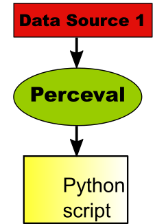

As shown in the figure above, data retrieved by Perceval is consumed by a Python script, which produces, for example, a summary of the data in the repository. In this simple scenario, most of the components in GrimoireLab are not needed, and the setup is rather simple: just the Perceval Python module needs to be installed. This is the case explained in sections [Retrieving git metadata](/training/perceval/git.md), [Retrieving data from GitHub repositories](/training/perceval/github.md) and [Mail archives](/training/perceval/mail.md).

It is important to notice that each data source (for example, git, Bugzilla or Gerrit) we may be interested in getting information from several repositories. Usually Perceval will be run once for each of those repositories. But since the process is exactly the same, and the involved components too, in this section we won't show in charts the many repositories that may compose a given data source.

### Perceval: analyzing several data sources

The scenario can be a bit more complex when we need to do a simple analysis of several data sources. We can still retrieve data with Perceval, which will be called from our script.

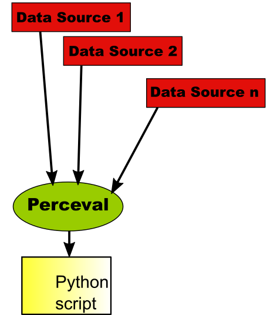

In fact, for each of the data sources, several repositories can be retrieved and analyzed. Therefore, this scenario can in fact become very complex, with a lot of analytics being performed by the Python script.

### Producing raw indexes

The above scenario is affected by a problem: every time you want to re-run the Python script, Perceval needs to access the data sources once again. This may be a problem if the data retrieval process is long, error-prone, or stresses too much the infrastructure where the data resides.

To avoid these problems, GrimoireLab allows for an scenario where data sources are retrieved only once: store all the retrieved data in ElasticSearch indexes. This is one of the functionalities provided by GrimoireELK: run Perceval to access data, and store it in one raw index per data source.

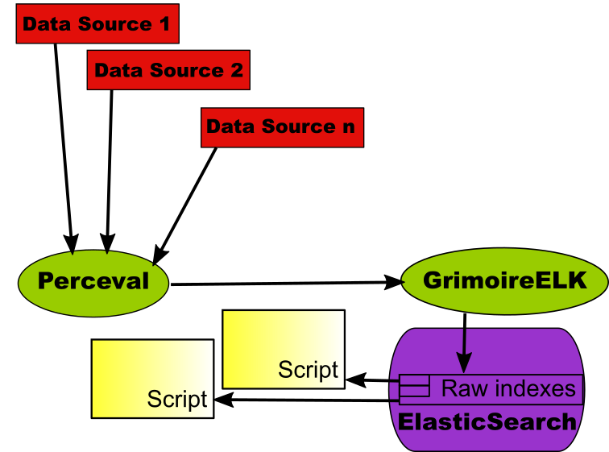

Now, the script just queries the ElasticSearch raw indexes, producing the same information that would be obtained if getting once and again the data from the original data sources. But once the data was retrieved, the script will be much faster, since it just queries the database instead of retrieving data from its origins. In addition, results are reproducible, as long as the indexes don't change. And of course, the infrastructure providing the data sources are not stressed because of our repeated analysis.

The main drawback of this approach is that the next time we run the script, maybe the data in the original data source changed. For example, more commits were merged, or new tickets were open, closed, or commented. If we want to do the analysis as we would do in the original data source, we need to retrieve the new data, and store it in ElasticSearch. Fortunately, GrimoreELK has incremental capabilities for satisfying this need. If we want, we can run it incremental mode, which will drive GrimoireELK to use Perceval to retrieve only new data since when the original data source was accessed.

This means that we can use this scenario to retrieve data once, and do reproducible analysis on the ElasticSearch indexes, or to retrieve it incrementally, having up-to-date indexes. But still, the analysis will be much faster than retrieving all the data again from its origins, and will stress much less the original infrastructure.

Scripts programmed to exploit raw indexes in ElasticSearch don't need to be written in Python. Since they only need to access ElasticSearch, almost any language can be used, as long as it can access ElasticSearch REST API. In fact, many languages are supported by specific modules to access ElasticSearch.

### Producing enriched indexes

Raw indexes include all the information in the original data sources. Because of that, they are good for any analysis that needs all that information. But that also causes raw indexes to be massive, and complex: they follow the data structure provided by the API of the original data source. In many cases, that structure can be cumbersome, or too complex: many analysis only need a summary of it. For example, when analyzing tickets in an issue tracking systems, in many case you just want some parameters for each of the tickets: when it was open, who opened it, when it was closed, maybe the summary...

For this kind of analysis, GrimoireLab provides the enriched indexes. They are in fact intended to be consumed by Kibiter, but they may be useful for many other purposes. Enriched indexes are usually flat, in the sense that they don't nest data: each item is just a collection of fields. Each item corresponds usually to a high level element of the data source: tickets, commits, messages, etc. These features of enriched indexes make them appropriate not only for visualization with Kibiter, but also for analysis. The scenario is as follows:

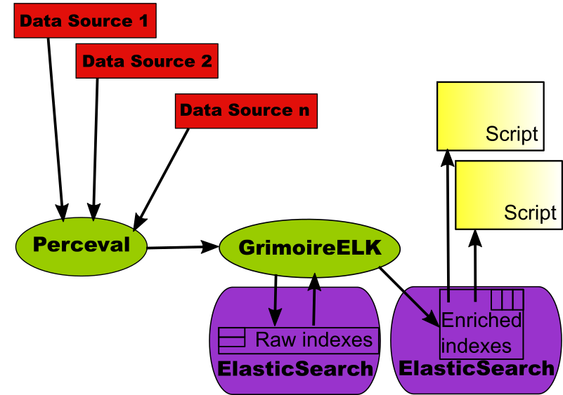

The component that produces enriched indexes is GrimoireELK, using information in the corresponding raw indexes. As with the raw indexes, GrimoireELK knows how to update information incrementally, if needed, based on the incremental capabilities of Perceval.

Scripts exploiting enriched indexes can be in any language, as was the case for raw indexes. They only need to be able of accessing ElasticSearch via its REST API.

### Enriched indexes with Sorting Hat

One of the most complex problems in analyzing information about how software developers work is identifying persons instead of just identities. When working in different systems, people use different identities. Or even in the same system: for example, they can use different email addresses when committing to git repositories. For dealing properly with the activity of persons, we need to merge these identities. Even for very simple metrics, such as how many people are collaborating in a git repository, you need to have those merged identities, or the metrics will be incorrect.

In GrimoireLab, we have a specific component for dealing with identities: SortingHat. It uses an SQL database (MySQL, MariaDB) for storing all identities found in data sources, and how they relate to real persons. In addition, it also supports adding some attributes to persons, such as their preferred name, or their affiliations (organizations for which they worked over time).

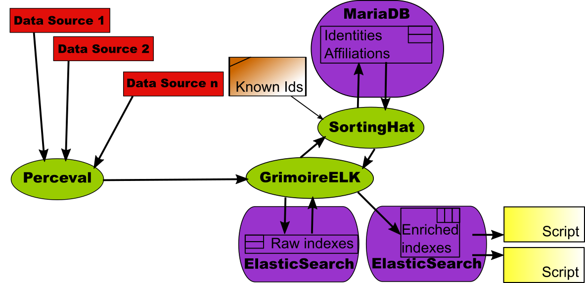

SortingHat is used by GrimoireELK. As a part of the enriching process, GrimoireELK stores with SortingHat any new identity found in raw indexes (and therefore, in data sources). GrimoireELK also consults SortingHat for learning about persons whenever it needs to enrich data with identities. In these case, the enriched indexes include, for every item, unique identities for persons, and affiliation information.

For doing its job, SortingHat runs several heuristics, but also reads identities files with trusted information in several formats. Those can be maintained by the projects themselves, or by a third party taking care of having accurate information about persons.

As in the previous scenarios, data in enriched indexes can be consumed by scripts, which can now use the additional information about unique identities, affiliation, etc.

### Kibiter: visualizing with dashboards

Actionable dashboards are very useful for understanding what is happening in software development projects. They allow for filtering the data by many criteria, selecting time periods of interest, drilling down, tracking evolution over time, and visualizing the data in many different ways. All of that with a simple and intuitive user interface.

The component in GrimoireLab providing this functionality is Kibiter, a soft fork of Kibana. It shows complete dashboards in a browser, as an HTML5 application.

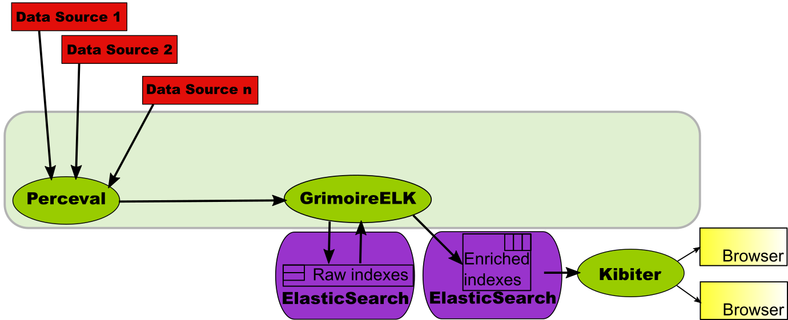

In this case, the enriched indexes are fed directly  to Kibiter. In it, they are available for building visualizations and dashboards on top of it. This scenario is considered in detail in [Creating a simple dashboard](/grimoireelk/a-simple-dashboard.md), which walks you through the specific steps needed to produce the dashboard from the datasources. The text describes how to use Kibana instead of Kibiter, but the process is basically the same.

Of course, this can be done, as shown above, not using SortingHat. But if SortingHat is used, unique identities, affiliations, etc. will also be available when designing visualizations and dashboards.

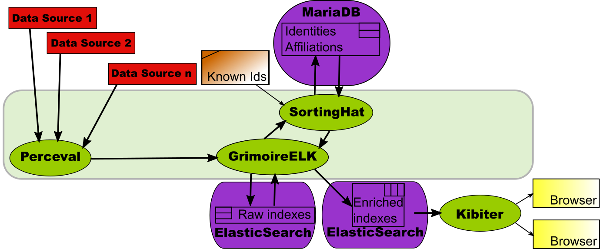

This scenario is covered in detail in [A dashboard with SortingHat](/grimoireelk/a-dashboard-with-sortinghat.md), using Kibana instead of Kibiter.

### Panels: predefined dashboards

Writing visualizations and panels with Kibiter (or Kibana, for that matter) is not difficult. But you need to learn how to do it, and in any case it is time-consuming. That's why GrimoireLab provides a component with predefined visualizations and dashboards for all the supported data sources: Panels.

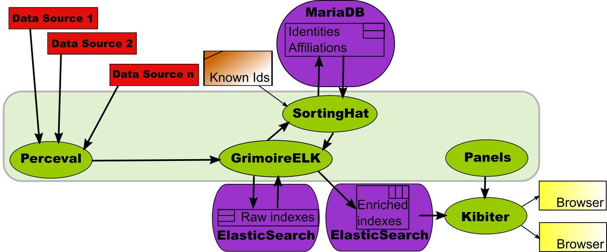

Panels provide a collection of JSON files which define visualizations and dashboards. In Kibiter, any visualization or dashboard can be exported and imported as a JSON file, and that's exactly what this collection allows. So, if you don't want to start your dashboard from scratch, you can set up a "standard GrimoireLab dashboard" by just uploading the files in Panels with `kidash`, as shown in [Managing dashboards with kidash](/grimoireelk/managing-dashboards-with-kidash.md).

These panels are already prepared to consider unique identities, affiliation data, and other goodies provided by SortingHat, so if you use them, be sure to have SortingHat in the toolchain.

### Mordred: from a configuration to a dasshboard

As can be seen from the pictures in the previous scenarios, setting up a complete dashboard involves several components, each of them with their own configurations, and with their own processes for interacting with the others. The time needed to master all the components, and the effort spent to correctly run them, is not neglectable. Here is where Mordred comes to the rescue.

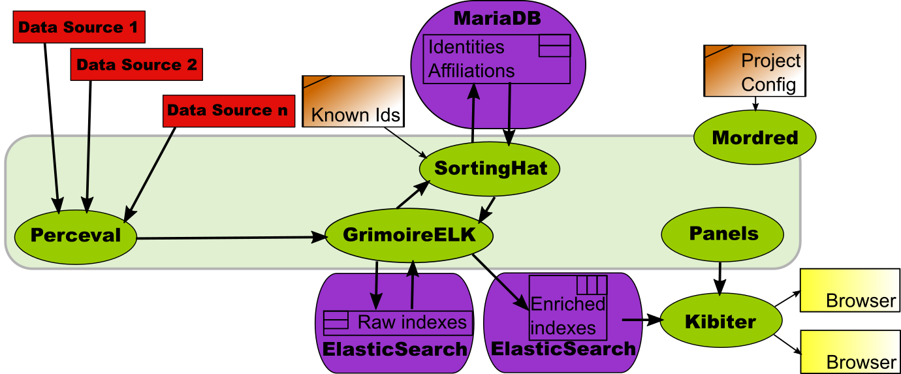

Mordred is a GrimoireLab component designed to read a configuration with all the data needed to produce a dashboard, and run all the other components so that the dashboard is actually produced.

Using Mordred the production of a dashboard is just writing down its configuration (list of data sources and repositories, configuration for SortingHat, location of panels, etc.), and running it. Almost by magic, a new dashboard is born. And what is even more important: it is also capable of running all the tools incrementally, so that the dashboard remains updated, with fresh data from the data sources, automatically.

### Arthur: orchestrating data retrieval.

For a relatively small project, the data retrieval process, even in incremental updating mode, is straightforward. Start with the first repository from the first data source, use Perceval to retrieve new data from it, do the same with the second repository, and so on until all repositories for the first data source are visited. Then do the same with the second data source, etc. When all the data sources are visited, start over again.

But in real large projects, this is not good enough. The time needed to cycle through repositories this way may be too long, and we need to parallelize. In addition, not all data sources are the same, and maybe we want to run processes for data retrieval for some of the data sources in some specific virtual machines. Whatever the case, we need to orchestrate how different Perceval processes are retrieving data, so that the process is efficient and smooth.

This is the work of Arthur. Arthur uses a Redis database to store data about retrieval jobs, and retrieved batches of items. It takes care of managing all active retrieval jobs, and can cope with parallel and periodic jobs, which makes the system really powerful. Although in many setups Arthur is not needed, large, production environments usually benefit from it.

Since GrimoireELK is designed to work both with Arthur and without it, the process of including it in the toolchain is transparent to other components

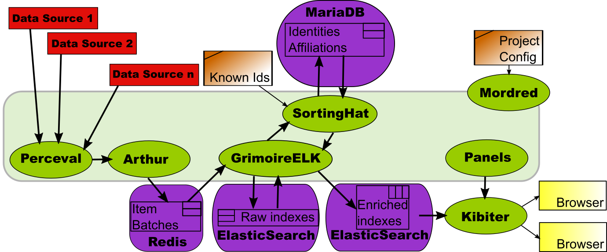

The above chart shows a full-fledged GrimoireLab setup for producing an industrial-grade production dashboard. Let's use it to review how all of the components interact:

* Perceval retrieves data from the different repositories in the data sources.
* Arthur schedules retrieval jobs in parallel instances.
* GrimoireELK produces the raw indexes, with all the data retrieved from the data sources.
* GrimoireELK interacts with SortingHat, to inform it of new identities found, and to be informed about unique identities and related information.
* With data from raw indexes and SortingHat, GrimoireELK produces enriched indexes, formatted for being visualized by Kibiter.
* Preconfigured visualizations and dashboards from Panels are uploaded to Kibiter.
* When a browser shows a dashboard, it uses Kibiter to visualize data coming from enriched indexes.
* Mordred configures all the components for producing the dashboard, and ensures that the data available to Kibiter is updated continuously with any new data in the data sources.

### Standard reports

In some cases, neither scripts nor dashboards are convenient for exploiting the rich information in the indexes. In some cases, what is needed is "static reports", usually in the form of PDF documents. This scenario is covered by the Reports GrimoireLab component.

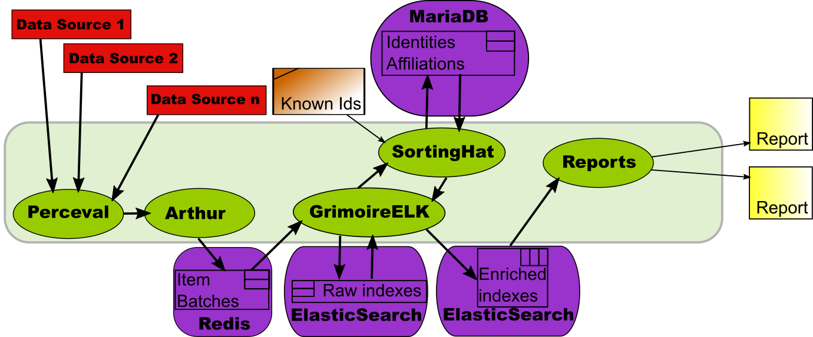

The components involved to produce the enriched index are the same than for producing a dashboard. The difference is Reports, a component that computes several metrics useful for a specific report on a project, and produces tables and charts for them. The result is a PDF document.

It is no surprise that the scenario is quite similar to the one described in [Enriched indexes with SortingHat](#enriched), above: instead of a custom script, now we have those provided by Reports.
