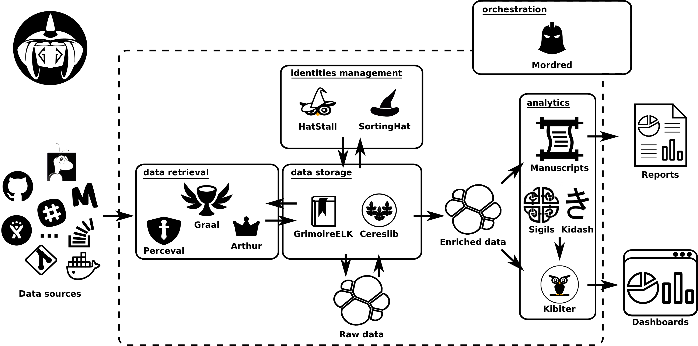

# GrimoireLab Components

The following figure summarizes the different tools used in GrimoreLab.

GrimoireLab is composed of different tools, which are listed below:

### Data retrieval related components:
  - [Perceval](https://github.com/chaoss/grimoirelab-perceval): retrieval of
    data from data sources
  - [Graal](https://github.com/chaoss/grimoirelab-graal): source data analysis
    with external tools
  - [KingArthur](https://github.com/chaoss/grimoirelab-kingarthur): batch
    processing for massive retrieval

### Data enrichment related components:
  - [GrimoireELK](https://github.com/chaoss/grimoirelab-elk): storage and
    enrichment of data
  - [Cereslib](https://github.com/chaoss/grimoirelab-cereslib): generic data
    processor
  - [SortingHat](https://github.com/chaoss/grimoirelab-sortinghat): identity
    management

### Data consumption related components:
  - [Kibiter](https://github.com/chaoss/grimoirelab-kibiter): dashboard,
    downstream version of Kibana
  - [Sigils](https://github.com/chaoss/grimoirelab-sigils): visualizations and
    dashboards
  - [Kidash](https://github.com/chaoss/grimoirelab-kidash): visualizations and
    dashboards manager
  - [Manuscripts](https://github.com/chaoss/grimoirelab-manuscripts): reporting

### Platform management, orchestration, and common utils:
  - [Mordred](https://github.com/chaoss/grimoirelab-mordred): orchestration
  - [GrimoireLab Toolkit](https://github.com/chaoss/grimoirelab-toolkit): common
    utilities
  - [Bestiary](https://github.com/chaoss/grimoirelab-bestiary): web-based user
    interface to manage repositories and projects for Mordred
  - [Hatstall](https://github.com/chaoss/grimoirelab-hatstall): web-based user
    interface to manage SortingHat identities
