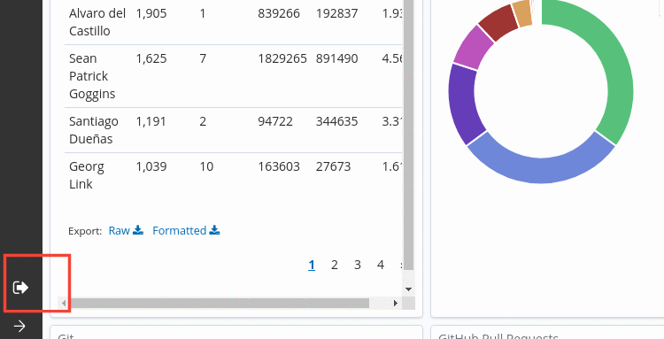
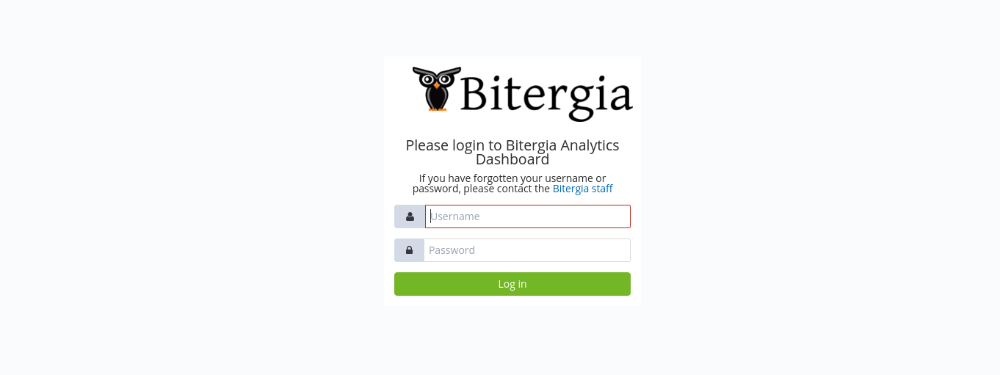

# Who has access to the dashboards

There are two main roles concerning dashboards access, 
- The user with permission to see the dashboards
- The user with permission to edit the dasboards and accessing indexes.

Lets take the example of [CHAOSS Community dashboards](http://chaoss.biterg.io).
Anyone can access their GrimoireLab dashboards and view the information as it is
publicly available. However, the CHAOSS Community dashboards has a login button
where only people with proper permission can login to perform actions such as
creating, editing and removing dashboards.

## How to login

##### Steps
- Look for the `Login` icon at the bottom of the sidebar.

- Clicking on it will bring you to the login page.

- Enter your credentials and press `Log in`.