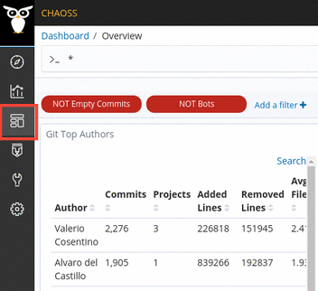
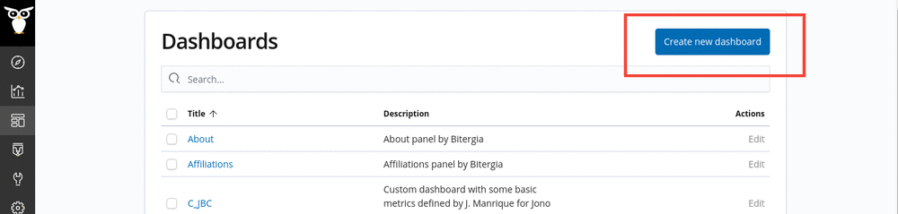
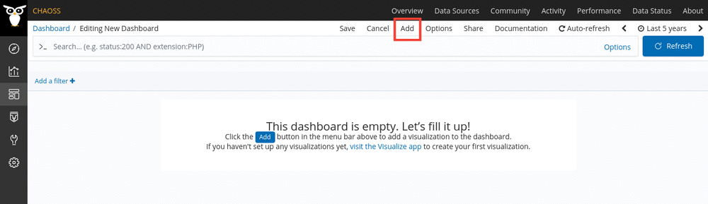

# How to create a dashboard

Creating a dashboard is pretty intuitive in GrimoireLab.

The first step is to open the dashboards interface which lists out all the
created dashboards. Click on the `Dashboard` icon in the sidebar. It is the
third one form the top.

To create a new dashboard, click on the button labelled `Create new dashboard`.
You can check out the existing dashboards below to get an idea of what kind of
dashboard you need.

Once you've clicked the `Create new dashboard` button, you'll be presented with
an empty dashboard which you can fill with the visualizations of your choice.
Click on the `Add` button to open the visualization sidepanel and click of the
needed visualizations to add them to your dashboard.

Once you've added your required visualization, you can save the dashboard by
pressing the `Save` button. It is the third one on the left from the `Add`
button. Make sure you're logged in before saving the dashboard.

**Note: You need to be logged in to perform this action**

You can learn more about the different accesses and the permissions associated
with them in the [Private and Public Access](docs/dashboards/access) section