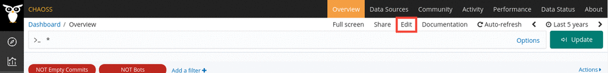
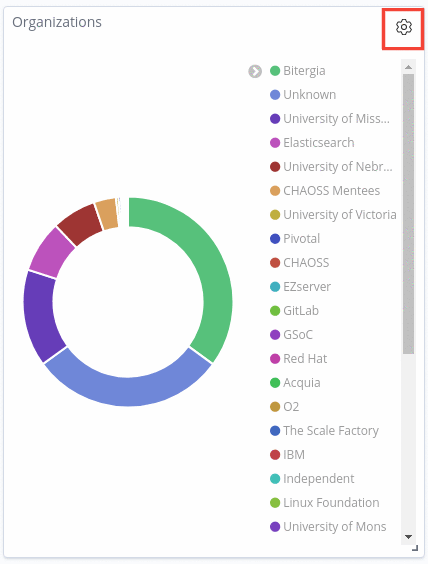
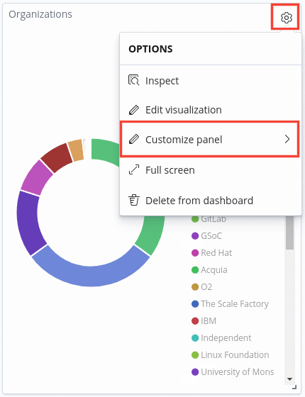
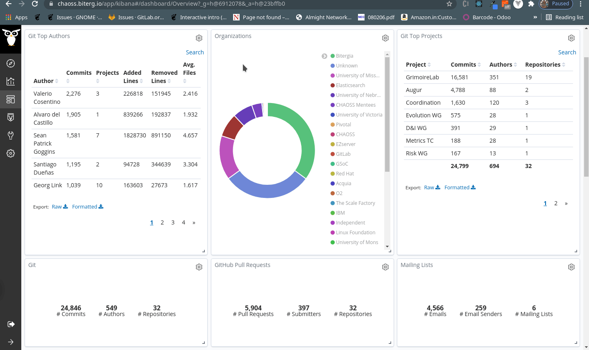
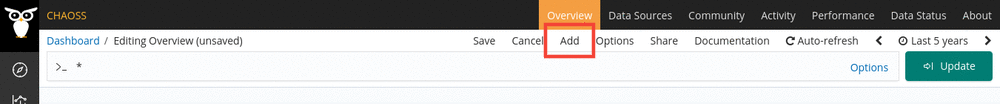
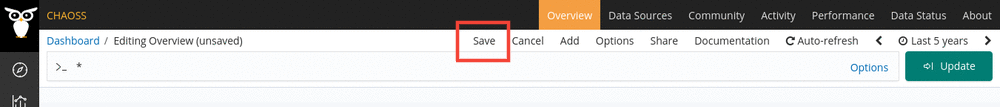

# How to edit a dashboard ?

A dashboard usually represent some visualization or table of some sort.
GrimoireLab allows you to execute the following queries in regards to your
dashboard.

## Edit panel's title

Editing a dashboard's title is simple.
- Steps
    1. Click on `Edit` in the navigation bar of GrimoireLab.

   

    2. Click on the `Settings` icon of the dashboard. This will open a dropdown.

    

    3. Click on `Customize panel` and change your dashboard's panel.

    

## How to arrange your panels

GrimoireLab provides you with the ability to move and display your panels in any
order you want.

- Steps
  1. Look for the "Edit" button and click it.

     

  2. Once you've done the above, edit mode will be active. You can then drag any
     panels around and arrange it in any way you want.

     

## How to add a visualization to your dashboard

Dashboards would not serve any purpose visualizations. In case you want to add a
visualization to your dashboard, follow the steps below.

- Steps
    1. Click on `Edit` in the navigation bar of GrimoireLab.

    

    2. Click on `Add` on the same navigation bar. This should open the side
       panel titled `Add Panel`.

    

    3. Click on your visualization on choice and it will get added onto your
       dashboard.

    4. Click on `Save` to save the changes to your dashboard.

    

Note: If you want to edit your visualization, please refer to [this
section](docs/dashboards/visualization/). Content on how to edit your
visualization is covered there.
