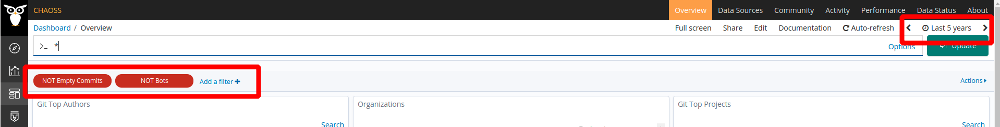
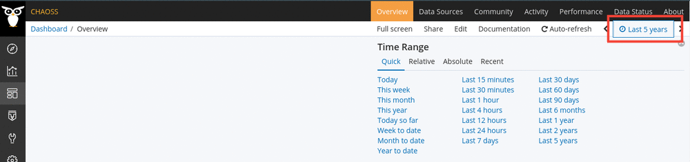
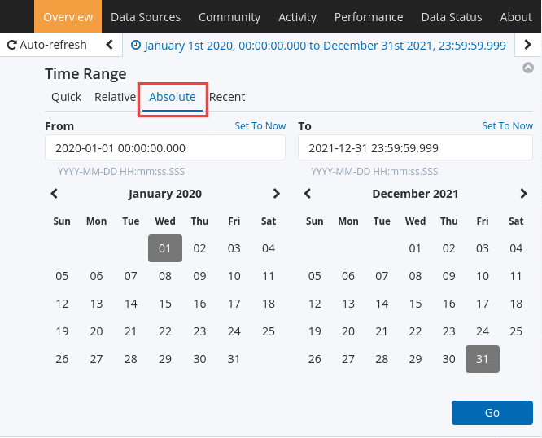
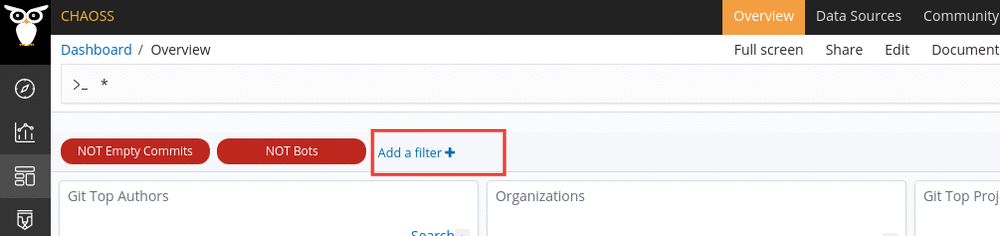
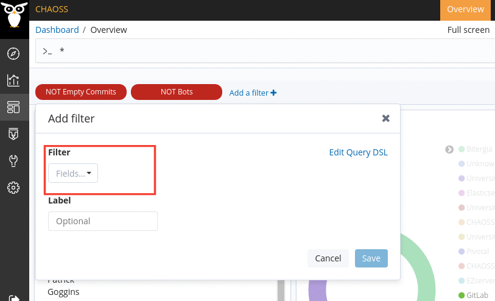
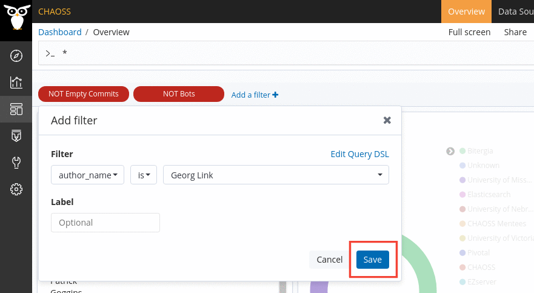
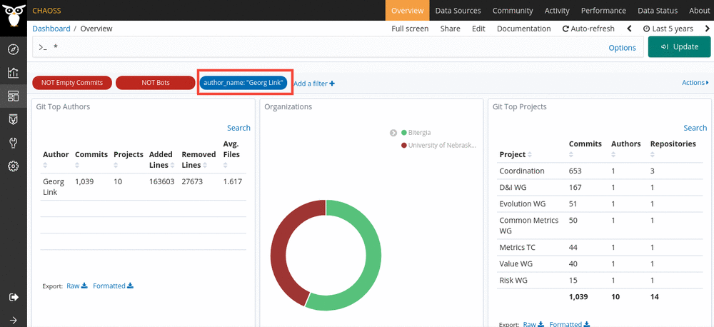

# How to filter data

There are two places in GrimoireLab where we can change and add filters.

- Time Picker
- Normal Filters



### Time Picker

Most dashboards are based on item creation date. So you can filter according to
a time frame. Time Picker allows you to visualize data according to a particular
time frame.



You can also set a custom time picker if needed. Go to the section `Time picker
quick ranges` in `Management` -> `Advances Settings` and add your quickRanges to
the list. An example of quickRange is provided below. `from` and `to` contain
date values, `display` is the title thay will be displayed in kibiter and
`section` defines the column where the quickRange will be added.

**Note: You need to be logged in to save your custom time picker. Check the
[private and public access](/docs/dashboards/access) section
to understand about permissions in GrimoireLab dashboards.**

```
{
  "from": "2020-03-21 00:00:00",
  "to": "2020-04-24 00:00:00",
  "display": "Most active period",
  "section": 3
}
```

You can also set a custom time picker without actually looking into settings. 

1. Click on Time Picker and choose "Absolute".



2. Set your time frame and press on "Go" to apply the filter.

### Normal Filters

You can set a filter by clicking on **Add filter**. This filter allows you to
set a particular key-value pair and display the visualizations according to that
value. You can even set the operators to check for that particular value orevery
other data except the one mentioned.

#### Steps

- Click on "Add filter" on top of your panels.

  

- A popover will appear. Choose your field, the operator and the filtering
  value.

  

- Once you've set your values, save it and the visualizations should re-ajust to
  fit your filter.


