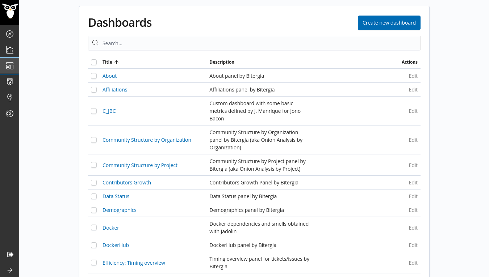

# Dashboards

GrimoireLab provides a user or a community with the ability to monitor, evaluate
and analyze the health of their project through several metrics and
visualizations. The latters are displayed in a layout called a dashboard.
You can create several dashboards to monitor different aspects of your project.

In this section, we'll be talking about how to use the dashboards and interact
with the features available.

