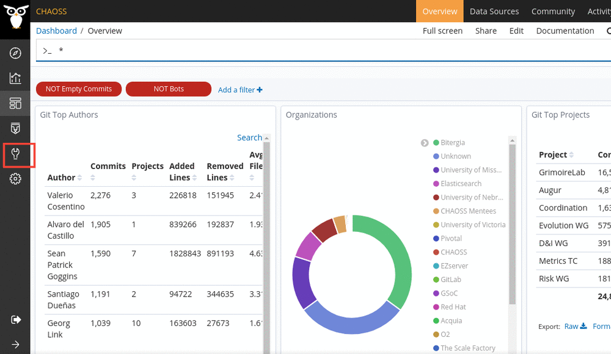
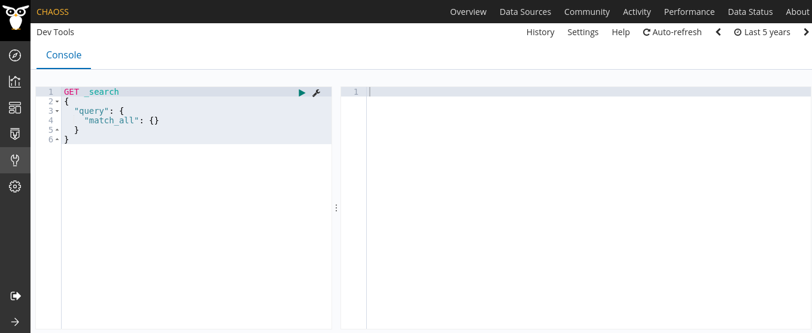
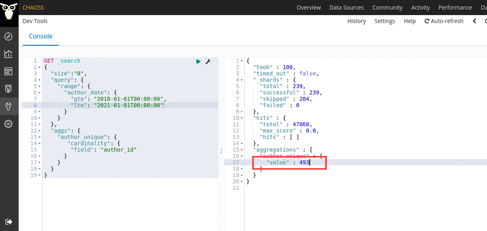

# How to query data in Elasticsearch using Dev tools

GrimoireLab allows its users to interact with the data through its dev tools.

### Steps

- Look for Dev Tools in the sidebar and open it.



- Once you have dev tools open, the following interface should be visible to
  you. The console is divided into two sections, an editor panel and a response
  panel. Type your query in the editor panel and press the green play button to
  submit your query.



For example, the query below counts the number of unique authors on a git
repository from 2018-01-01 to 2021-01-01

```
GET _search
{
  "size":"0",
  "query": {
    "range": {
      "author_date": {
        "gte": "2018-01-01T00:00:00",
        "lte": "2021-01-01T00:00:00"
      }
    }
  },
  "aggs": {
    "author_unique": {
       "cardinality": {
        "field": "author_id"
      }
    }
  }
}
```

The `size` parameter specifies that we do not need the data fetched from the
index, this is included as only count of authors is required and not data of
authors. The `query` parameter includes the `range` of the field `author_date`
for which the data is requested. The number of distinct author are calculated
using `cardinality` of `author_id`.

#### Output

```
{
  "took" : 130,
  "timed_out" : false,
  "_shards" : {
    "total" : 239,
    "successful" : 239,
    "skipped" : 204,
    "failed" : 0
  },
  "hits" : {
    "total" : 47860,
    "max_score" : 0.0,
    "hits" : [ ]
  },
  "aggregations" : {
    "author_unique" : {
      "value" : 493
    }
  }
}
```

The `value` field hold the number of distinct authors for the time frame
provided.



You can refer to the [ElasticSearch
Docs](https://www.elastic.co/guide/en/elasticsearch/reference/6.8/search-search.html)
to get an overview on how to use queries.

You can also refer to the [data source
schemas](https://github.com/chaoss/grimoirelab-elk/tree/master/schema) to get an
idea on their corresponding fields.