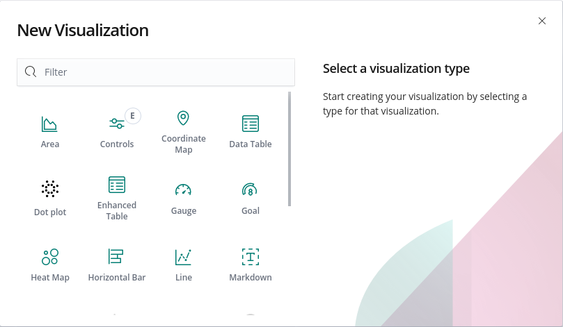
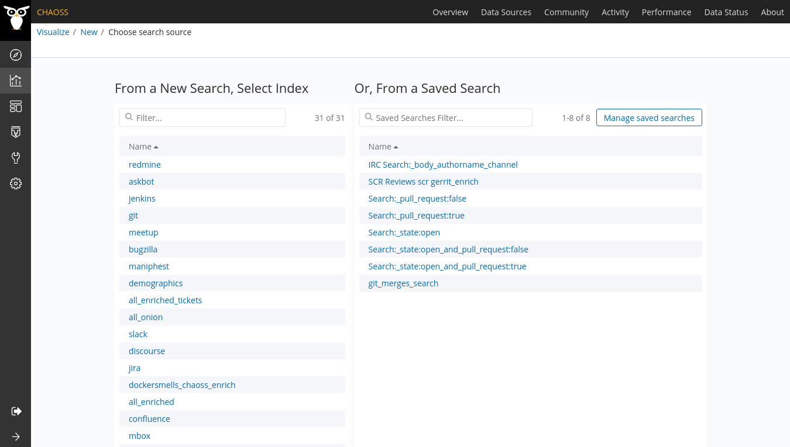
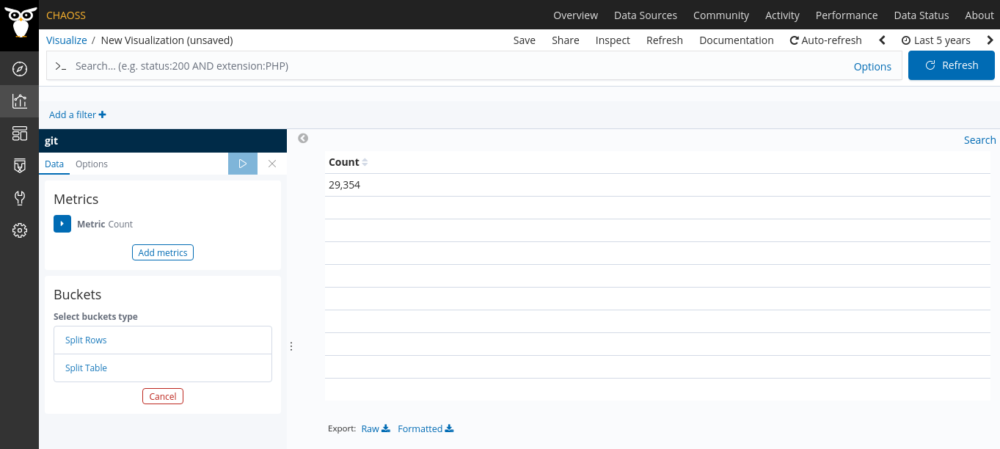
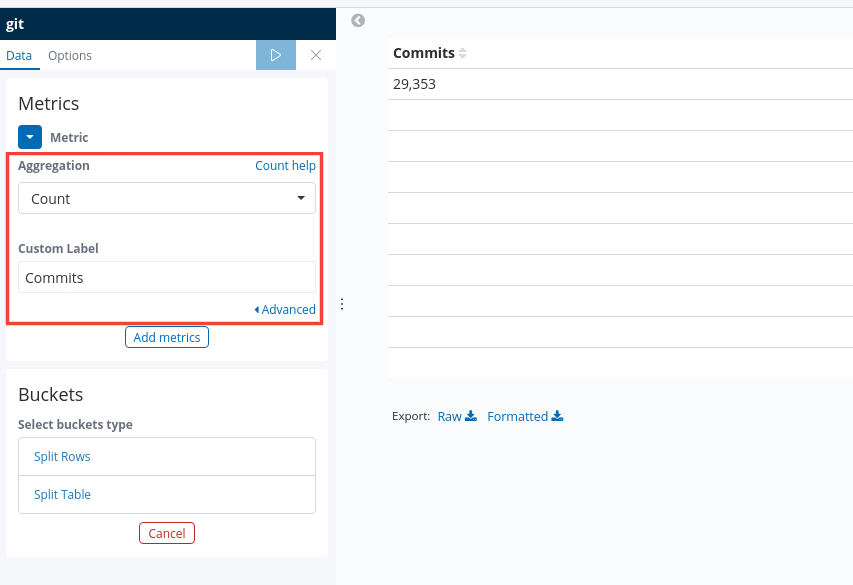
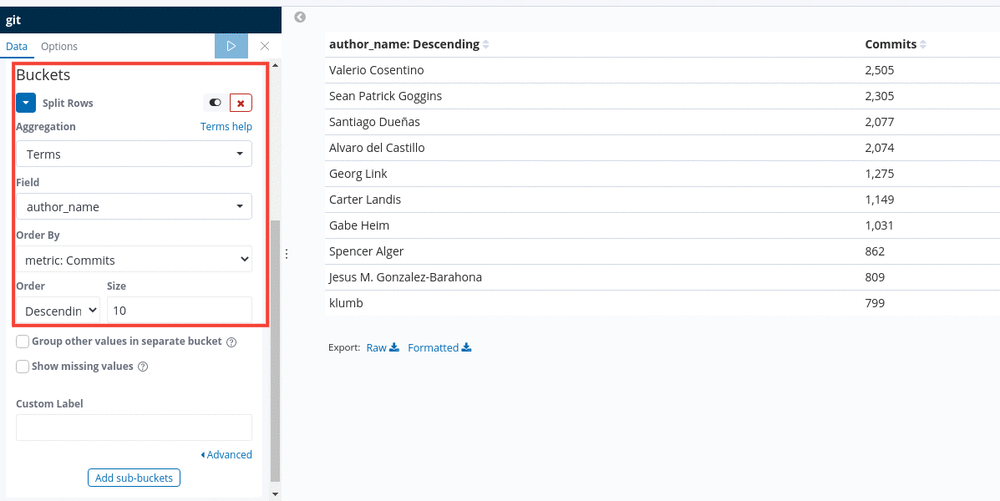
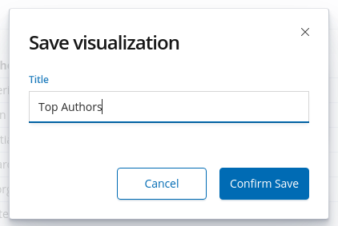

# How to create a visualization ?

In order to make this section easy to understand, we'll divide into 3
sub-sections:
- Choosing a visualization type
- Choosing an index
- Making the visualization

## Choosing a visualization type

A visualization, as the name suggests, is the representation of your data in the
form of a diagram of some sort (pie-chart, data table, heat map etc...)

In order to start creating your visualization, you need to decide on a
visualization type. Usually the choice of a visualization type is an obvious
choice since the user will have an idea of what it should look like.

### Steps
1. Navigate to the `Visualize` dashboard. You can do so by clicking on the
   `Visualize` icon in the sidebar. It's the second icon from the top.
2. Once you have the above open, click on the `+` icon to open up the
   visualization types panel.
   
3. Pick the visualization of your choice based on your preference.

## How to choose an index ?

Before we choose an index, we need to understand the meaning of an index.

**An index** refers to a collection of JSON documents related to a particular
data source (git, jenkins, slack, etc...). Every index will have an
index-pattern that shows the different attributes in an index. 

When creating your visualization, you will use fields from the index-pattern to
generate your index-pattern

## Making the visualization

We need to understand two important terms here,
**Buckets** and **Metrics**

### Metrics
Metrics in the visualization interface will refer to a single number for each
aggregation you select. For example, **Count** will return the count of all the
documents in the index.

### Buckets
Bucket, as the name suggest, is different from metrics. It is different in the
sense that It does not calculate metrics overs fields like metrics aggregation
does. Instead they create buckets of document and each bucket is associated with
a criterion which determines whether or not a document in the current context
"falls" into it.

Now, let's take an example.

*We want to create a data table. The table should contain the name of the
authors and their respective number of commits.*

#### Steps
1. Navigate to the `Visualize` dashboard. It's the second icon from the top in
   the sidebar.
2. Click on `+` because we want to crate a new visualization.
3. Choose `data table` because we want a table kind of visualization.
4. Regarding the index, we'll go with `git` because we want to analyze commit
   information as mentioned above.

Once you've completed the above, you should be presented the following layout.

As you can see one metric aggregation is already set, **Count** which returned
the number of document present in the index.

5. Now, we need to set out metrics. We need to gather all the documents in git.
   In order to do that, we can set up a **Count** aggregation that will return
   the total number of documents present in the index.

   

6. Now we need to set our buckets. We want to have every author with their
   respective number of commits. As such we'll set our buckets to use the
   **Terms** aggregation and field, **Author_name**.

   

   **Note: Press the play button at the top panel to visualize your changes.**

You might notice that some fields are very similar. For example,
`Author_org_name` and `author_org_name`. The latter is usually used in the
current visualizations and is the one that should be used to build new
visualizations.

7. So we got our visualization. Now we need to save it. Press on the `Save`
   button in the navigation bar just above the dashboard query bar. A popover
   will open and you'll have to enter the name of your new visualization.

   

   **Note: You need to be [logged in]({{ site.baseurl }}) to be able to save the visualization.**