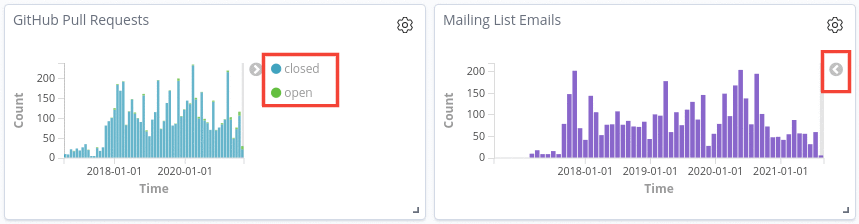

# Edit a visualization

In order to edit a visualization and save it, you need to be [logged
in]({{ site.baseurl }}).
- Steps
    1. Click on `Edit` in the navigation bar of GrimoireLab.
    2. Click on the `Settings` icon of the dashboard. This will open a dropdown.
    3. Click on `Edit Visualization`.
    4. Change/Add your <a href="{{ site.baseurl }}#metrics">Metrics</a> and <a
       href="{{ site.baseurl }}#buckets">Buckets</a> and press the play button to visualize it.
    5. Once satisfied, `Save` your visualization.

**Note**: Refer to [how to create a visualization]({{ site.baseurl }}) to understand the editing interface.

## How to change the color of visualizations

Some visualizations make use of graphs, charts and tables to represent data. In
order to represent the different data, several contrasting colors are used.

- Steps
  1. Find the panel in which you want to change the color.
  2. Every panel that makes use of colors will have the sample color and the
     data it represents on the right side of the panel. In the case it is not
     visible, click on the arrow key on the right side of the panel. 

     

  3. Once you've clicked on the sample color, a palette of colors will be
     displayed. You just have to choose your preferred color. 

     
