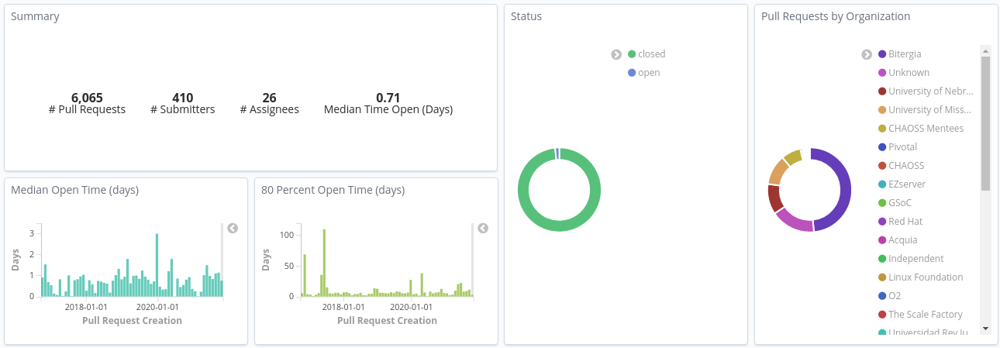

# Visualizations

The best way to understand your data is to visualize it. GrimoireLab allows
users to pick one or more index patterns and create visualizations to bring
clarity about their data. It can be displayed in the form of charts, tables,
maps and many more which allow you to compare your data side-by-side to identify
patterns and connections

