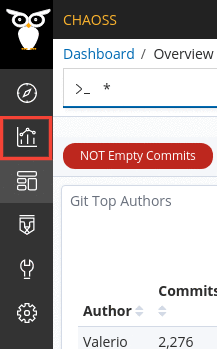
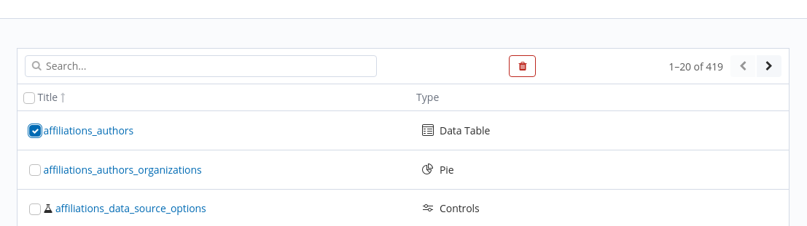

#  Remove visualization from dashboard

For this action, you need to [logged in]({{ site.baseurl }}) as well.
- Steps
    1. Click on `Edit` in the navigation bar of GrimoireLab.
    2. Click on the `Settings` icon of the dashboard. This will open a dropdown.
    3. Click on `Delete from dashboard`.
    4. Press on `Save` in the navigation bar to save it.

**Note**: The above action removes the visualization from the current dashboard
only but the visualization would still be available in your visualizations
lists. In case you want to remove a dashboard entirely, follow the next steps.

## Delete a visualization

- Steps
    1. Click on `Visualize` on the sidebar. It is the second icon from the top.

    

    2. Search of the needed visualization and check it.
    3. Once you've checked the required visualizations, you'll see a trash icon
       next to the search bar.

    

    4. Click on the trash icon to delete the checked visualizations.

Note: You need to be [logged in]({{ site.baseurl }}) to be able to perform the above action.