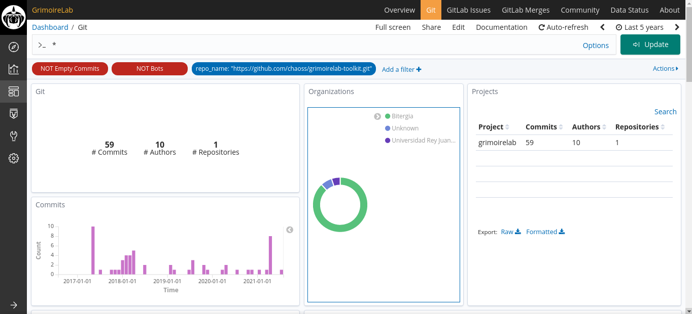

# How to analyze data from software development repositories

GrimoireLab supports a variety of software development platforms. In the case
you want to analyze data from one of those platforms, first check whether the
platform in question is supported by GrimoireLab. You can check the [supported
data sources]({{ site.baseurl }})
section.

Once you've confirmed your data source, you will have to do some changes in both
`project.json` and `setup.cfg`.

For example, let's just say you want to analyze the commits of one particular
project from your github repo.

### projects.json

Replace the below configurations in the `projects.json` file.

```
{
    "grimoirelab": {
        "git": [
            "https://github.com/chaoss/grimoirelab-toolkit.git"
        ]
    }
}
```

### setup.cfg

Replace the below configurations in the `setup.cfg` file.

```
[git]
raw_index = git_raw
enriched_index = git_enriched
latest-items = true
studies = [enrich_demography:git, enrich_git_branches:git, enrich_areas_of_code:git, enrich_onion:git, enrich_extra_data:git] (optional)

<!-- THE LINES BELOW ARE OPTIONAL -->

[enrich_demography:git]

[enrich_git_branches:git]
run_month_days = [1, 23]

[enrich_areas_of_code:git]
in_index = git_raw
out_index = git-aoc_enriched

[enrich_onion:git]
in_index = git_enriched
out_index = git-onion_enriched

[enrich_forecast_activity]
out_index = git_study_forecast
```

Once you have made the following changes, run your containers with
docker-compose

```console
$ docker-compose up -d
```

Give it some time to gather the data and after a while your dashboard and data
should be ready at `http://localhost:5601`.



In the case you need to add another data source, please refer to [how to
configure projects.json & setup.cfg]({{ site.baseurl }}) files and also the
[configurations]({{site.baseurl }}).
