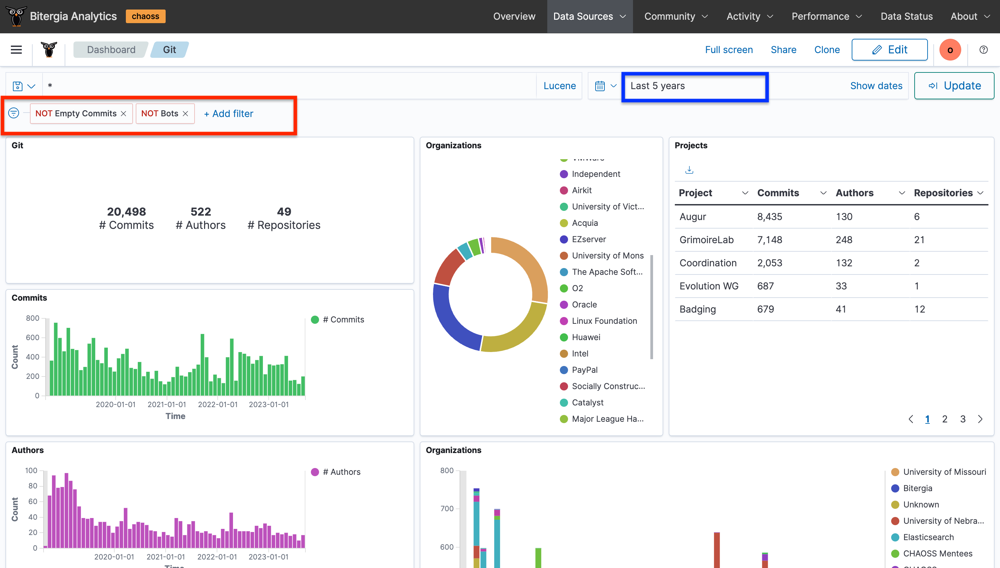

# Setup GrimoireLab

There are currently two ways to setup GrimoireLab, either through **docker** or
**docker-compose**. In this tutorial, we'll be talking about **docker-compose
only** due to the fact that it's currently the easiest and simplest method to
get started with.

## Requirements

- [Git](https://git-scm.com/book/en/v2/Getting-Started-Installing-Git)
- [Docker](https://docs.docker.com/engine/install/)
- [Docker Compose](https://docs.docker.com/compose/install/)
- At least 8GB RAM, 2 CPUs and 2GB virtual memory for ElasticSearch

You can make sure that you have the above software and hardware requirements
through the following means.

### Software

```bash
git --version
# git version 2.32.0

docker --version
# Docker version 20.10.7, build f0df35096d

docker-compose --version
# docker-compose version 1.28.5, build c4eb3a1f
```

### Hardware

```bash
cat /proc/cpuinfo | grep processor | wc -l        #View number of processors
# 4

grep MemTotal /proc/meminfo                       #View amount of RAM available
# MemTotal:        8029848 kB

sudo sysctl -w vm.max_map_count=262144            #Set virtual memory
# vm.max_map_count = 262144
```

The reason for allocating `262144` for memory is the check that ElasticSearch
performs on boot. It ensures that the kernel allows at least 261144 memory
mapped areas.

## Steps

- Clone the GrimoireLab repo:

```bash
git clone https://github.com/chaoss/grimoirelab
```

- Go to `docker-compose` folder and run the following command:

```bash
cd grimoirelab/docker-compose
sudo docker-compose up -d
```

Your dashboard will be ready after a while at `http://localhost:5601`. Usually,
it takes about 10-15 minutes to show the data in the dashboards. But, the
waiting time depends on the size of the repositories.



Please check the [Troubleshooting]({{ site.baseurl }}) page if you face any issues.
