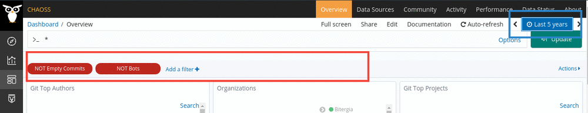

# Troubleshooting

> Please check this page if you face any problem with setting up GrimoireLab. If
> you didn't find the solution for your problem, please open an [issue in the
> chaoss/grimoirelab repository](https://github.com/chaoss/grimoirelab/issues).
> If you found out the reason, and would like to add it to this section, please
> feel free to open a [pull request to the chaoss/grimoirelab-tutorial
> repository](https://github.com/chaoss/grimoirelab-tutorial/pulls).

> If something goes wrong during the docker-compose setup, run the
> docker-compose command without the `-d` or `--detach` flag. That will allow
> you to see all the logs while starting/(re)creating/building/attaching
> containers for a service.
  ```bash
  cd grimoirelab/docker-compose
  docker-compose up
  ```
---

## Table of Contents
{: .no_toc .text-delta }

1. TOC {:toc}

---

### Port already in use

It may also happen that the port, 5601, is already allocated to some other
container. So running docker-compose will lead to the following error

```
WARNING: Host is already in use by another container
```

In order to fix it, you need to see which container is using that port and kill
that container.

```bash
docker container ls   # View all running containers
CONTAINER ID   IMAGE                                                     COMMAND                  CREATED         STATUS                     PORTS                                                 NAMES
01f0767adb47   grimoirelab/hatstall:latest                               "/bin/sh -c ${DEPLOY…"   2 minutes ago   Up 2 minutes               0.0.0.0:8000->80/tcp, :::8000->80/tcp                 docker-compose_hatstall_1
9587614c7c4e   bitergia/mordred:latest                                   "/bin/sh -c ${DEPLOY…"   2 minutes ago   Up 2 minutes (unhealthy)                                                         docker-compose_mordred_1
c3f3f118bead   bitergia/kibiter:community-v6.8.6-3                       "/docker_entrypoint.…"   2 minutes ago   Up 2 minutes               0.0.0.0:5601->5601/tcp, :::5601->5601/tcp             docker-compose_kibiter_1
d3c691acaf7b   mariadb:10.0                                              "docker-entrypoint.s…"   2 minutes ago   Up 2 minutes               3306/tcp                                              docker-compose_mariadb_1
f5f406146ee9   docker.elastic.co/elasticsearch/elasticsearch-oss:6.8.6   "/usr/local/bin/dock…"   2 minutes ago   Up 2 minutes               0.0.0.0:9200->9200/tcp, :::9200->9200/tcp, 9300/tcp   docker-compose_elasticsearch_1
```
```bash
docker rm -f c3f3f118bead          #c3f3f118bead is the container that is using port 5601.
```

### Empty dashboard or visualization

Usually this is a matter of time for GrimoireLab to fetch the data from the
configured data source. However It may happen that some <span style="color:
red">filters</span> might be activated. You can see whether a filter is active
by looking at the filter bar as shown in the following screenshot or the <span
style="color: #2f4bff">time window</span>.



### Low Virtual Memory

Indication

Cannot open `https://localhost:9200/` in browser. Shows `Secure connection
Failed`, `PR_END_OF_FILE_ERROR`, `SSL_ERROR_SYSCALL in connection to
localhost:9200` messages.

Diagnosis

Check for the following log in the output of `docker-compose up`
```bash
elasticsearch_1  | ERROR: [1] bootstrap checks failed
elasticsearch_1  | [1]: max virtual memory areas vm.max_map_count [65530] is too low, increase to at least [262144]
```

Solution

Increase the kernel `max_map_count` parameter of vm using the following command.
```bash
sudo sysctl -w vm.max_map_count=262144
```

Now stop the container services and re-run `docker-compose up`. Note that this
is valid only for current session. To set this value permanently, update the
`vm.max_map_count` setting in `/etc/sysctl.conf` file. To verify after
rebooting, run the below command.
```bash
sysctl vm.max_map_count
```

### Processes have conflicts with SearchGuard

Indication

Cannot open `localhost:9200` in browser, shows `Secure connection Failed`
```bash
curl -XGET localhost:9200 -k
curl: (52) Empty reply from server
```

Diagnosis

Check for the following log in the output of `docker-compose up`
```bash
elasticsearch_1  | [2020-03-12T13:05:34,959][WARN ][c.f.s.h.SearchGuardHttpServerTransport] [Xrb6LcS] Someone (/172.18.0.1:59838) speaks http plaintext instead of ssl, will close the channel
```

Check for conflicting processes by running the below command (assuming 5888 is
the port number)
```bash
sudo lsof -i:5888
```

Solution

1. Try to close the conflicting processes. You can do this easily with fuser
```bash
sudo apt-get install fuser
```
Run the below command (assuming 5888 is the port number)
```bash
fuser -k 58888/tcp
```
Re-run `docker-compose up` and check if `localhost:9200` shows up.'

2. Use a [docker-compose without
   SearchGuard](/grimoirelab-tutorial/docs/getting-started/dev-setup/#getting-the-containers).
   With this docker-compose, the ES doesn't include SearchGuard, access to the
   Kibiter and Elasticsearch don't require credentials. Re-run `docker-compose
   up` and check if `localhost:9200` shows up.

### Permission Denied

Indication

Can't create indices in Kibana. Nothing happens after clicking create index.

Diagnosis

Check for the following log in the output of `docker-compose up`
```bash
elasticsearch_1 |[INFO ][c.f.s.c.PrivilegesEvaluator] No index-level perm match for User [name=readall, roles=[readall], requestedTenant=null] [IndexType [index=.kibana, type=doc]] [Action [[indices:data/write/index]]] [RolesChecked [sg_own_index, sg_readall]]
elasticsearch_1 | [c.f.s.c.PrivilegesEvaluator] No permissions for {sg_own_index=[IndexType [index=.kibana, type=doc]], sg_readall=[IndexType [index=.kibana, type=doc]]}
kibiter_1 | {"type":"response","@timestamp":CURRENT_TIME,"tags":[],"pid":1,"method":"post","statusCode":403,"req":{"url":"/api/saved_objects/index-pattern?overwrite=false","method":"post","headers":{"host":"localhost:5601","user-agent":YOUR_USER_AGENT,"accept":"application/json, text/plain, /","accept-language":"en-US,en;q=0.5","accept-encoding":"gzip, deflate","referer":"http://localhost:5601/app/kibana","content-type":"application/json;charset=utf-8","kbn-version":"6.1.4-1","content-length":"59","connection":"keep-alive"},"remoteAddress":YOUR_IP,"userAgent":YOUR_IP,"referer":"http://localhost:5601/app/kibana"},"res":{"statusCode":403,"responseTime":25,"contentLength":9},"message":"POST /api/saved_objects/index-pattern?overwrite=false 403 25ms - 9.0B"}
```
or any type of 403 error.

Solution

This message generally appears when you try to create an index pattern but you
are not logged in Kibana. Try logging in to Kibana (the login button is on the
bottom left corner). The credentials used for login should be
`username`:`password` `admin`:`admin`.

### Empty Index

Indication and Diagnosis

Check for the following error after executing [Micro
Mordred](https://github.com/chaoss/grimoirelab-sirmordred/tree/master/sirmordred/utils/micro.py)
using the below command (assuming `git` is the backend)
```bash
micro.py --raw --enrich --panels --cfg ./setup.cfg --backends git
```

```bash
[git] Problem executing study enrich_areas_of_code:git, RequestError(400, 'search_phase_execution_exception', 'No mapping found for [metadata__timestamp] in order to sort on')
```

Solution

This error appears when the index is empty (here, `git-aoc_chaoss_enriched`
index is empty). An index can be empty when the local clone of the repository
being analyzed is in sync with the upstream repo, so there will be no new
commits to ingest to grimoirelab.
  
There are 2 solutions to this problem:
1. Disable the param
   [latest-items](https://github.com/chaoss/grimoirelab-sirmordred/blob/master/sirmordred/utils/setup.cfg#L78)
   by setting it to false.
```cfg
latest-items = false
```
2. Delete the local clone of the repo (which is stored in
   `~/.perceval/repositories`).

For more understaning:
  
The Git backend of perceval creates a clone of the repository (which is stored
in `~/.perceval/repositories`) and keeps the local copy in sync with the
upstream one. This clone is then used to ingest the commits data to grimoirelab.

Grimoirelab periodically collects data from different data sources (in this
specific case, a git repository) in an incremental way. A typical execution of
grimoirelab for a git repository consists of ingesting only the new commits to
the platform.

These commits are obtained by comparing the local copy with the upstream one,
thus if the two repos are synchronized, then no commits are returned and hence
Index will be empty. In the case where all commits need to be extracted even if
there is already alocal clone, latest-items param should be disabled. Another
option is to delete the local clone (which is stored at
`~/.perceval/repositories`), and by doing so the platform will clone the repo
again and extract all commits. 
 
### Low File Descriptors

Indication

Cannot open `localhost:9200` in browser, shows `Secure connection Failed`
```bash
curl -XGET localhost:9200 -k
curl: (7) Failed to connect to localhost port 9200: Connection refused
```

Diagnosis

Check for the following log in the output of `docker-compose up`
```bash
elasticsearch_1  | ERROR: [1] bootstrap checks failed
elasticsearch_1  | [1]: max file descriptors [4096] for elasticsearch process is too low, increase to at least [65536]
```

Solution

1. Increase the maximum File Descriptors (FD) enforced. You can do this by
   running the below command.
```bash
sysctl -w fs.file-max=65536
```
To set this value permanently, update `/etc/security/limits.conf` content to
below. To verify after rebooting, run
```bash
sysctl fs.file-max
```
```
elasticsearch   soft    nofile          65536
elasticsearch   hard    nofile          65536
elasticsearch   memlock unlimited
```

2. Override `ulimit` parameters in the Elasticsearch docker configuration. Add
   the below lines to Elasticsearch service in your compose file to override the
   default configurations of docker.
```yml
ulimits:
nofile:
  soft: 65536
  hard: 65536
```

### Rate Limit Exhausted

Indication

See error message `RuntimeError: Rate limit exhausted.; 3581.0 seconds to rate
reset`

Solution

Enable the `sleep-for-rate` parameter. It increases rate by sleeping between API
call retries.
```cfg
sleep-for-rate = true
sleep-time = 300
```

### No Swap Space

Indication

While composing docker , NO SWAP SPACE would be displayed.

Solution

Edit the `/etc/default/grub file` with sudo previleges and restart the system.
```
GRUB_CMDLINE_LINUX="cgroup_enable=memory swapaccount=1"
sudo update-grub
```

### SSL error

Indication

`localhost:9200` refuses connection error.

Diagnosis

```bash
Retrying (Retry(total=10,connected=21,read=0,redirect=5,status=None)) after connection broken by 
'SSLError(SSLError{1,'[SSL: WRONG_VERSION_NUMBER] wrong version number {_ssl.c:852}'},)': /
```

Solution

Change `https` to `http` in the `setup.cfg` file if you are using the
Elasticsearch without the SearchGuard. See
[defining-the-es-configurations](/grimoirelab-tutorial/docs/getting-started/dev-setup/#defining-the-es-configurations).
```cfg
[es_collection]
url = http://localhost:9200

[es_enrichment]
url = http://localhost:9200
```

### Cloc installation

Diagnosis

```bash
: [Errno 2]No such file or directory : 'cloc': 'cloc'
```

Solution

Execute the following command to install `cloc` (more details are available in
the
[Graal](https://github.com/chaoss/grimoirelab-graal#how-to-installcreate-the-executables)
repo).
```bash
sudo apt-get install cloc
```

### Incomplete data

Indication

Not all the data is being retrieved when rebuilding an index - only from a point
in time forward.

Diagnosis

After a rebuild of git-based indices you are not receiving a full dataset as
expected, but only from the date of the re-index forward. That data is complete,
but anything prior to that is missing.

Solution

The `setup.cfg`  file has an option under the Git configuration section:
`latest-items = true` - set this to `latest-items = false` to pull in all data
from the beginnning. Once this has been processed, remember to set it back to
`latest-items = true`!

### Directory Not Found

Indication

While you are running the `cocom` backend with micro-mordred, you might receive
an error log of `[Errno 2] No such file or directory:
'/tmp/worktrees/grimoirelab-toolkit-git'`. Encountered this error while [setting
up grimoirelab using source code and docker
method](/grimoirelab-tutorial/docs/getting-started/dev-setup/#source-code-and-docker).

Diagnosis

The `cocom` backend would require worktrees. The micro-modred by default will
attend to reach a location at `<worktrees-path>/grimoirelab-toolkit-git`.

Solution

You can create the directory manually:
- make sure you installed `cloc` (see
  [chaoss/grimoirelab-graal/README](https://github.com/chaoss/grimoirelab-graal#how-to-installcreate-the-executables))
- create two directory `mkdir /somepath` and `mkdir
  /somepath/grimoirelab-toolkit-git`
- use `/somepath/` as the `worktree-path` in `setup.cfg`'s `[cocom]` section.
  (see how to configure `cocom` in
  [chaoss/grimoirelab-sirmordred/README](https://github.com/chaoss/grimoirelab-sirmordred#cocom-))
- rerun the command `python micro.py --raw --enrich --cfg ./setup.cfg --backends
  git cocom`

Reference
[chaoss/grimoirelab-sirmordred/#/539](https://github.com/chaoss/grimoirelab-sirmordred/issues/539)
