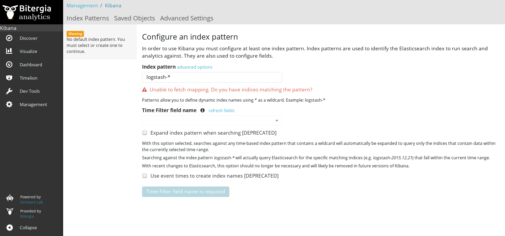
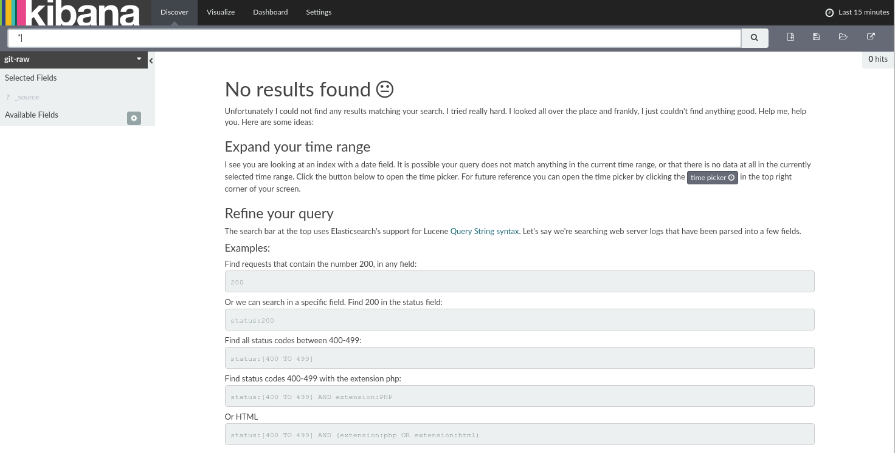

## Installing supporting systems

GrimoireLab modules need some supporting components to work.
This section shows in some detail how to install them.
If you have those components already installed, or are using
Docker images, very likely you can skip this section.

These supporting components are:

* Python3: GrimoireLab is written in Python3, so you need to have it installed. At least Python 3.5 is recommended, but older versions could work.
* Programs for retrieving data from data sources. In some cases, some programs will be needed when retrieving data, since GrimoireLab/Perceval will use them. The most common case is `git`, for the git GrimoireLab/Peerceval backend.
* ElasticSearch: if you want to store raw or enriched GrimoireLab indexes (produced by GrimoireELK).
* Kibiter: if you want to visualize enriched indexes (produced by GrimoireELK). For example, because you want to browse GrimoireLab dashboards. You can also install vanilla Kibana (Kibiter is a soft fork from Kibana), although in that case maybe some of the functionality will not be available.
* MariaDB: if you want to use SortingHat for identity management.


### Versions, architecture

These installation instructions, and in general all stuff in this tutorial,
are tested with:

* Architecture. GrimoireLab is being developed mainly on GNU/Linux platforms, and in particular, in Debian 9 and derivatives.
It is very likely it will work out of the box on any Linux-like (or Unix-like) platform,
provided the right version of Python is available. In other platforms, your mileage will vary. We will appreciate experiences of use in any specific architecture (see chapter on Contributing).

* Python version. GrimoireLab is built to run with Python3. Most reasonably recent Python3 versions will work. The examples have been tested with Python 3.5.

* GrimoireLab version. In general, the examples shown in this tutorial should work with the latest version of the GrimoireLab packages in Pypi. See the next sections for how to install everything that is needed.


### Installing Python3

Python3 is a standard package in Debian, so it is easy to install:

```bash
sudo apt-get install python3
```

Once installed, you can check the installed version:

```bash
python3 --version
```

For installing some other Python modules, including GrimoireLab modules, you will need `pip` for Python3. For using `venv` virtual environments, you will also need `ensurepip`. Both are available in Debian and derivatives as packages `python3-pip` and `python3-venv`:

```bash
sudo apt-get install python3-pip
sudo apt-get install python3-venv
```

More information about installing Python3 in other platforms is available in [Properly installing Python](http://docs.python-guide.org/en/latest/starting/installation/). In addition, you can also check information on [how to install pip](https://pip.pypa.io/en/stable/installing/).

### Installing git

If you are retrieving data from git repositories, you will need git installed. Pretty simple:

```bash
sudo apt-get install git-all
```

More information about installing git in other platforms is available in
[Getting Started - Installing Git](https://git-scm.com/book/en/v2/Getting-Started-Installing-Git).

### Installing Elasticsearch

If you do not already have an instance of Elasticsearch and Kibiter or Kibana that you will be using, you will need to manually install them.  They are not installed as part of the automated installation. The process is not difficult. Please ensure you're installing at least version 6.1 of both of them (currently, the most tested versions are 6.1.0 for Elasticsearch and 6.1.4 for Kibiter/Kibana). As a rule, versions for Kibana and ElasticSearch should be the same if they are to work together. If you are installing Kibiter, you can find out the latest release of it (see below), and install the corresponding ElasticSearch version.

For installing Elasticsearch you can follow its [installation instructions](https://www.elastic.co/guide/en/elasticsearch/reference/current/install-elasticsearch.html). You will need to have a Java virtual machine installed \(Oracle JDK version 1.8.x is recommended\), The rest is simple: download the installation file from the [ElasticSearch downloads area](https://www.elastic.co/downloads/elasticsearch), and install it, for example by unzipping the zip installation file.

Assuming the installed ElasticSearch directory is `elasticsearch`, to launch it you will just run the appropriate command \(no need to run this from the virtual environment\):

```bash
elasticsearch/bin/elasticsearch
```

This will launch Elasticsearch that will listen via its HTTP REST API at `http://localhost:9200`. You can check that everything went well by pointing your web browser to that url, and watching the ElasticSearch welcome message.

### Installing Kibiter

For installing Kibiter, grab the version you want from the [Kibiter releases at GitHub](https://github.com/grimoirelab/kibiter/releases). You will need the `.tar.gz` or `.zip` file (if available) for your version of choice. Then, follow the [Kibana installation instructions](https://www.elastic.co/guide/en/kibana/current/install.html) (see below for a summary of those instructions). Remember that you will need a version of ElasticSearch matching the version of Kibiter.

Once you are done, point your browser to [http://localhost:5601](http://localhost:5601) (asuming Kibana was installed in your local machine, using the default port), and you'll get something like:



### Installing Kibana

You can install Kibana instead of Kibiter. Maybe you will lose some functionality, but still most of the dashboards will likely work. If this is your case, follow the [Kibana installation instructions](https://www.elastic.co/guide/en/kibana/current/setup.html). The process is similar to ElasticSearch: download the installation file from [Kibana dashboards area](https://www.elastic.co/downloads/kibana), and install it for example by unzipping the zip installation file.

Assuming the installed Kibana directory is `kibana`, to launch it, again just run the appropriate command:

```bash
kibana/bin/kibana
```

This should serve a Kibana instance in `http://localhost:5601`. Point your web browser to that url, and you´ll see the Kibana welcome page.



Now, we´re ready to go.

### Installing ElasticSearch and Kibana from a Docker container

Instead of following the installation instructions mentioned above, you can also install ElasticSearch and Kibana as a Docker container, by using pre-composed images. For example:

```bash
docker run -d -p 9200:9200 -p 5601:5601 nshou/elasticsearch-kibana
```

Then you can connect to Elasticsearch by localhost:9200 and its Kibana front-end by localhost:5601. See [details about these Docker images in DockerHub](https://hub.docker.com/r/nshou/elasticsearch-kibana/)


### Installing MariaDB

If you are going to use SortingHat, you will need a database. Currently, MySQL-like databases are supported. In our case, we will use MariaDB. Installing it in Debian is easy:

```bash
sudo apt-get install mariadb-server
```

That's it, that's all.
