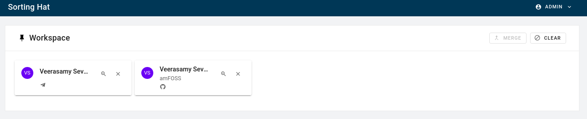
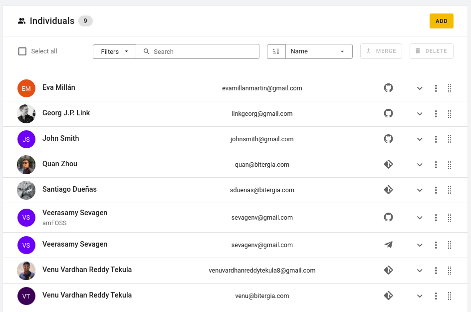
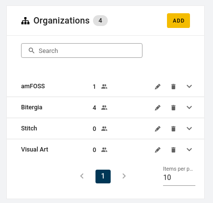

# SortingHat's new interface

As stated before, SortingHat is currently being revamped into a service and as a
result, its user-interface has been improved as well.

- **Workspace** is for keeping track of an individual's profile on which some
  actions can be performed later on. This is in the case where you have numerous
  profiles but need to perform some action on a few of them.

- **Individuals** is, as the name suggests, the table where all the individual's
  profiles can be found. Information such as name, email, identities and
  affiliations can be found out from their respective profiles.

- **Organisation** is the list of affiliations where an individual can be
  employed at.

