## Create a complete dashboard for Meetup

[Meetup](http://meetup.com) is one of the platforms used by many communities to organize meetings. It is popular among some development communities, and can be a good example of how to build a dashboard from scratch. The result that you'll get after going through this section will be similar to this screenshot:

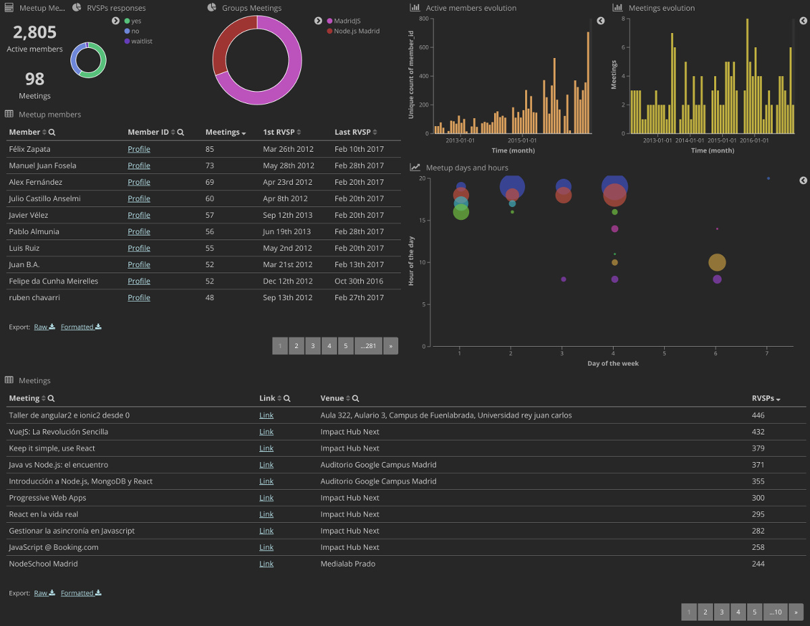

As in the previous sections, we will assume that all the needed Python modules (in this case, grimoire-elk and dependencies), ElasticSearch, and Kibana are already installed.

### Gathering Meetup groups data

To gather data about the Meetup group names to track, you need:

* Meetup group(s) name(s) to track
* Your [Meetup API key](https://secure.meetup.com/es-ES/meetup_api/key/) - this requires a Pro account

To get your key using the new Meetup OAuth Consumer, follow these steps:
1. Save [this file](https://gist.github.com/valeriocos/e16424bc7dc0f2d6dd8bb9295c6f9a4b) to your local computer as meetup-oauth.py
2. Execute the script using the command `python3 meetup-oauth.py` - you may need to install the requests module if you don't already have it enabled, using the command `pip3 install requests`
3. When prompted, enter your consumer key from your Meetup OAuth Consumer (accessed [here](https://secure.meetup.com/meetup_api/oauth_consumers/))
4. When prompted, enter the redirect URI from your Meetup Consumer, enclosed in quotes (e.g. "https://www.example.com")
5. Copy the URL which is output by the script, and take note of the code that will be appended to the URL when you press the 'allow' button on the authorization screen which is displayed (see below if you do not see a code in the final URL)
6. Paste the code back into the terminal window when prompted 
7. Copy the access token - this is what you need to use in the setup.cfg file for the API key

Note: If your site redirects on page load, you may not see the code in the final URL string.  To address this, open your browser developer tools, and under the network tab, select the check box 'preserve log'. Click once again on Allow and you should see the URL with the code at the top of the list of network activity - select the code from here.

For each of the group names, you only need to run the following command, assuming the group name is `group_name` and the Meetup API key is `meetup_key`:

```bash
(gl) $ p2o.py --enrich --index meetup_raw --index-enrich meetup \
-e http://localhost:9200 --no_inc --debug meetup group_name -t meetup_key --tag group_name
```

If the group has a sizable activity, the command will be retrieving data for a while, and uploading it to ElasticSearch, producing:

* A raw index: `meetup_raw`
* An enriched index, ready to be used from Kibana: `meetup`

### Building a dashboard

You need to start by loading your (running) Kibana instance in your browser, by pointing it to  [http://localhost:5601](http://localhost:5601). In the Kibana interface, click on `Management`, and then select `Index patterns` and `Add new`. Specify `meetup` as the `Index name of pattern`, and use `grimoire_creation_date` as `Time-field name` (this means to use that field for the time selector).

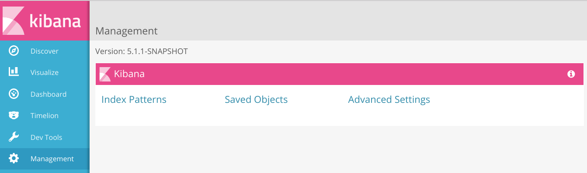

Once the index pattern is built, proceed to the `Discovery` section in Kibana to see how data looks like. For example, to check for information related to RVSPs we can create a new search:

1. Search for `is_meetup_rvsp=1`
2. Save it as `Meetup RVSPs`

Let's create some visualizations in the `Visualize` section of our Kibana. All of them will be done from 
the saved search `Meetup RVSPs`.

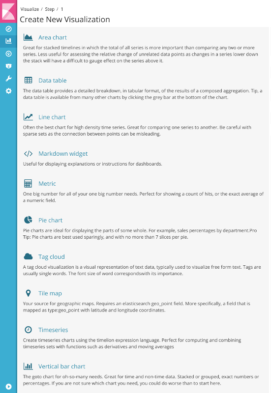

### Simple metrics

Create a `Metric` visualization to get active members (people who have *RVSP'ed*) and meetings.

To get active members, use following parameters:
```
Aggregation: Unique Count
Field: member_id
Custom Label: Active members
```

To get number of meetings, add following metric definition:
```
Aggregation: Unique Count
Field: event_url
Custom Label: Meetings
```

We save it as `Meetup metrics`.

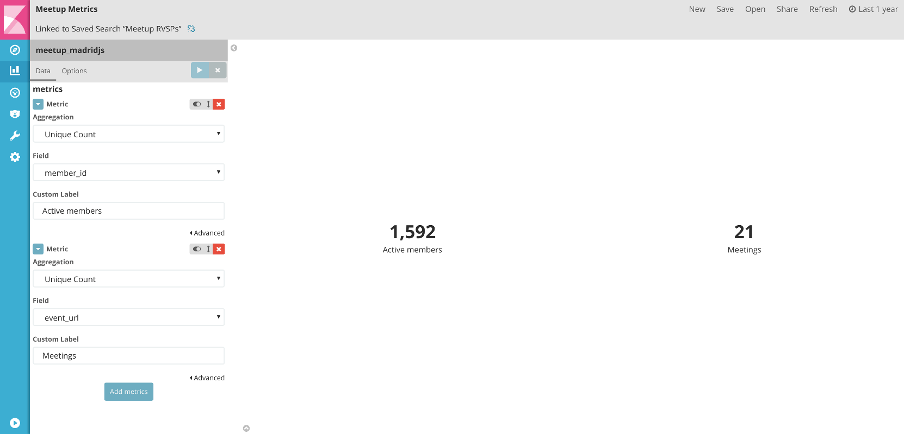

### Some tables

Let's create a *members table* to see:

* People names
* Profile link
* Number of meetings _RVSP'ed to_
* First time they have _RVSP'ed_
* Last time they have _RVSP'ed_

By selecting _Data table_ visualization, we might start by do a _unique count_ of _events_url_ (each meeting has an unique URL) that will show the total number of meetings in the selected time frame.

```
Aggregation: Unique Count
Field: event_url
Custom Label: Meetings
```

We could add first time and last time by adding following metrics:

```
Aggregation: Min
Field: grimoire_creation_date
Custom Label: 1st RVSP
```

```
Aggregation: Max
Field: grimoire_creation_date
Custom Label: Last RVSP
```

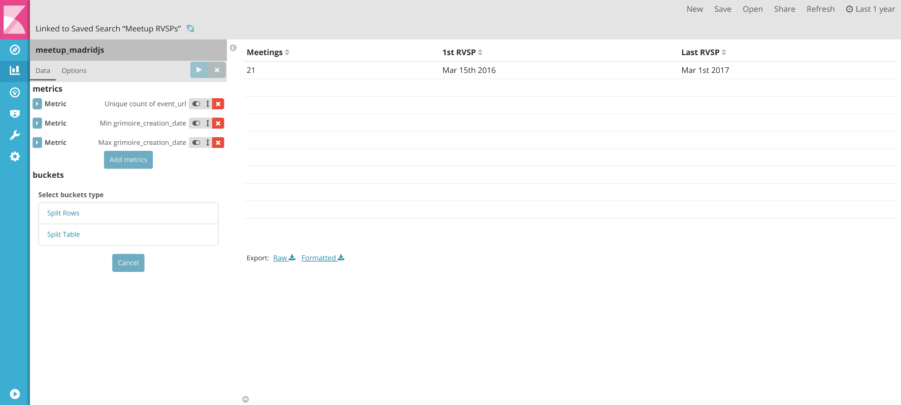

Now, we need to split the table in rows. The first thing is to split by _members names_:

```
Aggregation: Terms
Field: member_name
Orber: Descending
Size: 5000
Custom Label: Member
```

You could see that some people might have the same _name_, so they will be shown under the same `member_name` bucket. We need to split the rows again by an unique field. For example, `member_id`

What about using that field to provide the link to user's profile?

Save previous work as `Meetup Members`. Go to `Management / Index patterns` to see how the fields are defined:
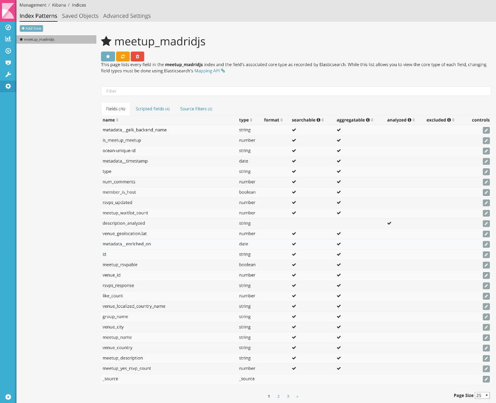

Look for `member_id` field an edit it (clicking in the pencil button) to use _url_ as format:

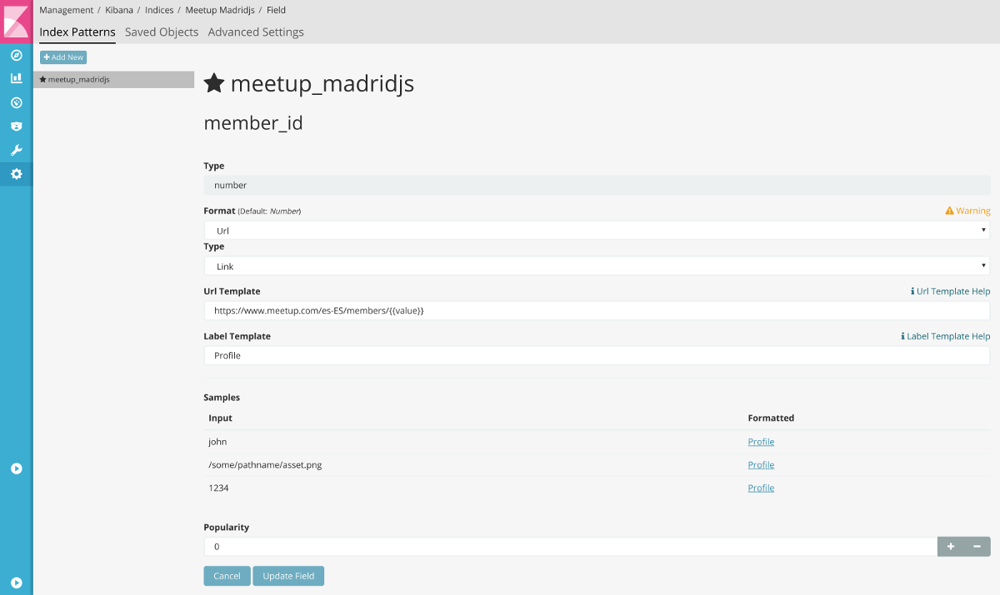

Update the field and go back to your saved `Meetup Members`visualization, and split rows defining:

```
Aggregation: Terms
Field: member_id
Orber: Descending
Size: 500
Custom Label: Profile
```

Run it, and once you have it ready, save it.

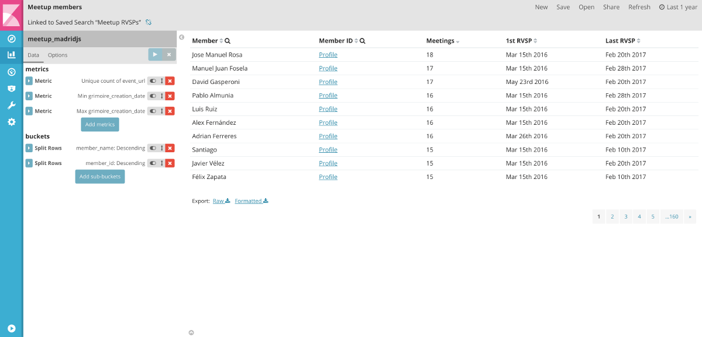

Using similar techniques, we might create a *meetings table*:

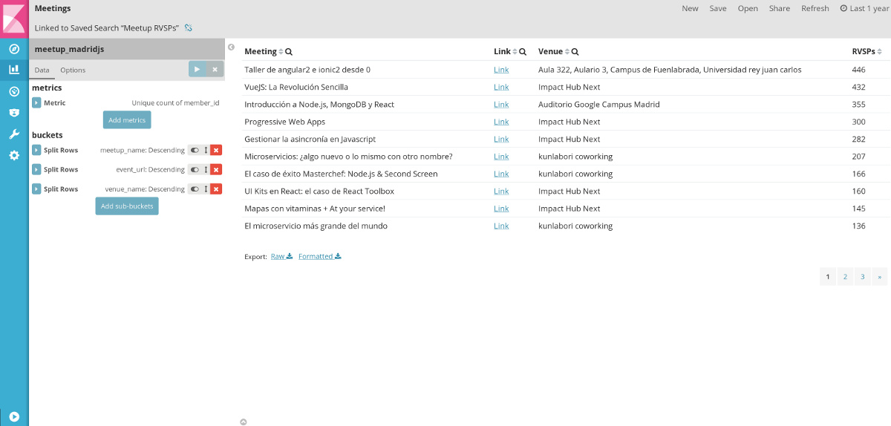

### RVSPs answers

RVSP might be "yes", "no" or you might be in a "waitlist".. Let's create a *pie chart* to show and allow filtering by response. Select `Pie chart` in the Visualize screen and define it by:

```
Slice size
Aggregation: Count
Custom Label: RSVPs
```
```
Split slice
Aggregation: Terms
Field: rvsps_response
Orber By: metrics:RVSPs
Order: Descending
Size: 5
Custom Label: RVSP Answer
```

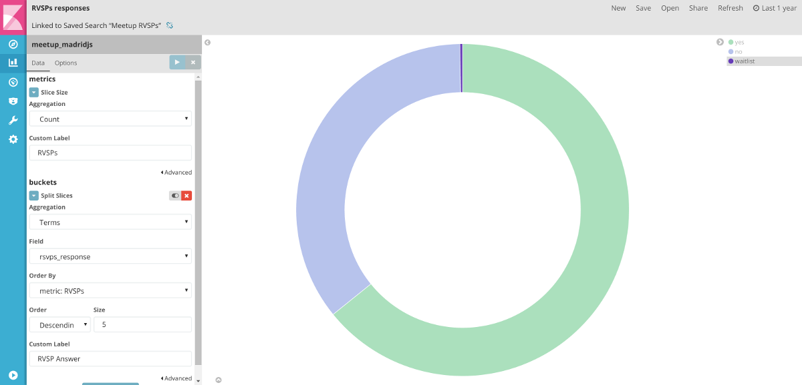

If you are tracking more than one Meetup group, you might need a pie chart or a table to allow filtering. Something like:


### Evolutionary charts

Evolutionary data can be printed using [Kibana Timelion](https://www.elastic.co/guide/en/kibana/current/timelion.html), but we will use a more simple approach by now.

Let's use the `Vertical bar chart` visualization to show a people _RSVP'ing_ over time. Let's define it as:

```
Metric
Aggregation: Unique Count
Field: member_id
Custom Label: RSVPs
```
```
X-Axis
Aggregation: Date Histogram
Field: grimoire_creation_date
Interval: Monthly
Custom Label: Date (Month)
```

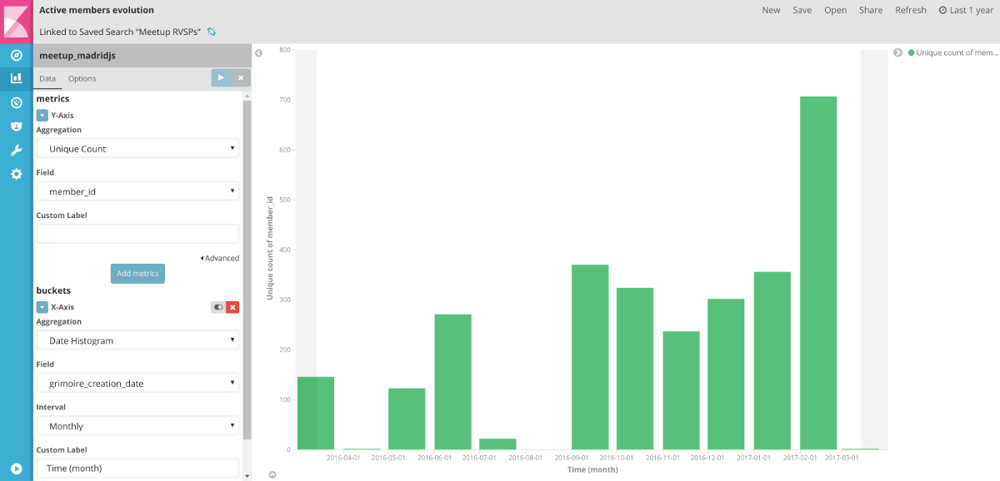

You could create a similar chart for meetings evolution, showing the number of unique meetings that people is RSVP'ing in each month.

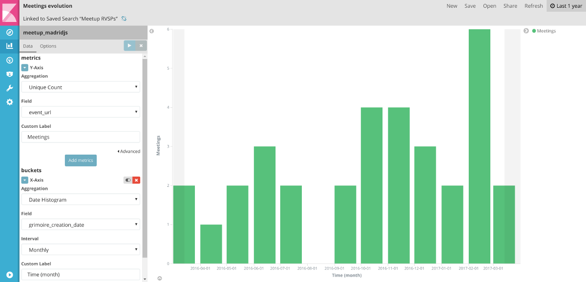

### Some *Painless*

In Kibana 5, Elastic has added a powerful scripting language to define new fields called [Painless](https://www.elastic.co/guide/en/elasticsearch/reference/5.2/modules-scripting-painless.html). Let's use it to see what are the top day of the week and time for meetings.

We have a field called `meetup_time` that showns the time and date for the meeting. We could get the day of the week number by creating an scripted field called `painless_meetup_day_int`  in `Management / Index patterns` as follows:

```
Languaje: Painless
Type: Number
Format: default
Popularity: 0
Script:

LocalDateTime meetup_day_date = LocalDateTime.ofInstant(Instant.ofEpochMilli(doc['meetup_time'].value), ZoneId.of('Z'));

return meetup_day_date.getDayOfWeek().getValue();
```

We could create also `painless_meetup_hour` in `Management / Index patterns` as follows:

```
Languaje: Painless
Type: Number
Format: default
Popularity: 0
Script:

LocalDateTime meetup_day_date = LocalDateTime.ofInstant(Instant.ofEpochMilli(doc['meetup_time'].value), ZoneId.of('Z'));

return meetup_day_date.getHour();
```

Now we have the data. Let's create a bubbles chart visualization for it by using the `Line chart`. To do it, we will use the following metrics:
* In the y-axis, we will show the hour of the day
* We will add `Dot-size` to represent number unique people RVSP'ed for that hour and day
* In the x-axis, we will show the day of the week

Let's define the chart parameters:

```
Metrics
Y-Axis: 
Aggregation: Average
Field: painless_meetup_hour
Custom Label: Hour of the day
Dot-size:
Aggregation: Unique Count
Field: member_id
```
```
X-Axis
Aggregation: Histogram
Field: painless_meetup_day_int
Interval: 1
Custom Label: Day of the week
Split Lines
Sub-aggregation: Terms
Field: painless_meetup_hour
Order-By: metric:Hour of the day
Order: Descending
Size: 500
```

To get the bubbles alone, you need to go to chart options tab and _uncheck_ `Show Connecting Lines` option. You should see something like:

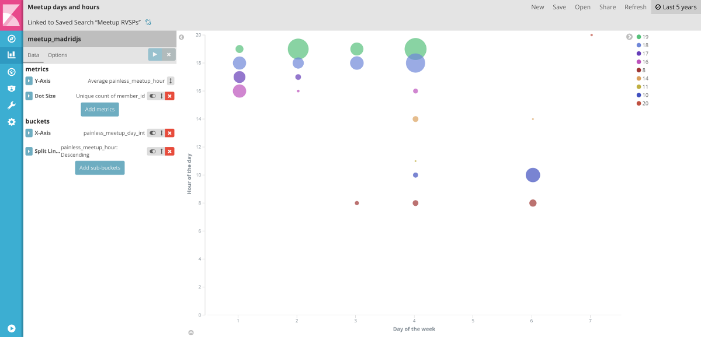

### Create the dashboard

In Kibana `Dashboard` section, add the previous saved visualizations to get something similar to this:


You can save it and play with it to drill down into details, like:

- Who is RVSP'ing the most?
- Which groups are more active?
- Where are meetups happening?
- Who is saying 'No' most of the times to meetup calls?
