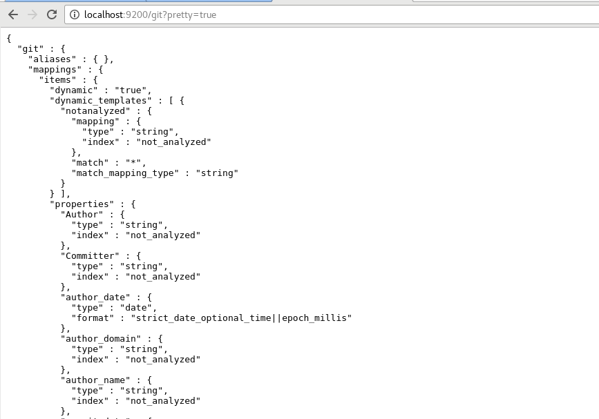
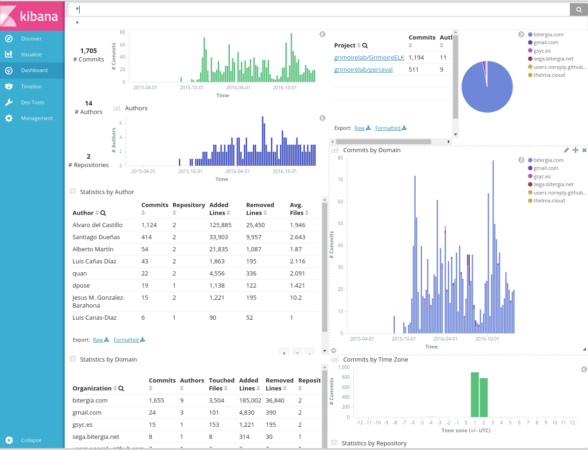

## Creating a simple dashboard

Creating a dashboard using the tools we just installed is not difficult:

* First, use p2o.py to retrieve the data from the data source, store it in ElasticSearch as a raw index, and then use it to produce the enriched index that will be used to animate the visualizations in the dashboard.
* Upload to Kibiter (or Kibana) the configuration needed for the dashboard that will show the enriched index mentioned above.

That's all. After that, you can just point your web browser to the dashboard link, and you are done.

Let's follow the process step by step for a simple dashboard showing information from two git repositories.

### Creating the indexes in ElasticSearch

Let's run `p2o.py` to create the indexes in ElasticSearch. We will create both the raw and the enriched index in one step. The raw index will contain all information retrieved from the data source (git repositories in this case), as provided by Perceval. The enriched index will contain the data used by the Kibana dashboard.

As an example, we produce indexes for two git repositories: those of Perceval and GrimoireELK. We will use `git_raw` as the name for the raw index, and `git` for the enriched one. We will store indexes in our ElasticSearch instance listening at `http://localhost:9200`. Each of the following commands will retrieve and enrich data for one of the git repositories:

```bash
(gl) $ p2o.py --enrich --index git_raw --index-enrich git \
  -e http://localhost:9200 --no_inc --debug \
  git https://github.com/grimoirelab/perceval.git
...
(gl) $ p2o.py --enrich --index git_raw --index-enrich git \
  -e http://localhost:9200 --no_inc --debug \
  git https://github.com/grimoirelab/GrimoireELK.git
...
```

These commands should have produced our two new indexes in ElasticSearch: `git_raw`, with the raw data as produced by Perceval, and `git`, with the enriched information, ready to be shown by a Kibana dashboard. You can check both by feeding the following urls to your web browser:

* [http://localhost:9200/git\_raw?pretty=true](http://localhost:9200/git_raw?pretty=true)
* [http://localhost:9200/git?pretty=true](http://localhost:9200/git?pretty=true)

In both cases, you will see a JSON document with the description of the index.



### Uploading the dashboard configuration {#uploading}

Then, the only missing element is a Kibana dashboard with its visualizations.
We can use `kidash` to upload to Kibiter/Kibana a dashboard definition
that we have ready for you in the [git-dashboard.json JSON file](dashboards/git-dashboard.json).
Download it to your `/tmp` directory
(Note: Please use 'Save Link as' option for downloading), and run the command:

```bash
(grimoireelk) $ kidash --elastic_url-enrich http://localhost:9200 \
  --import /tmp/git-dashboard.json
```

This should produce the promised dashboard, in all its glory! Point your web browser to [your Kibiter/Kibana instance](http://localhost:5601/), click on `Dashboard` in the top menu, and use the floppy icon \(on the top right list of icons\) to select the `Git` dashboard. Get some popcorn, now you should be able to play with the dashboard.



### Final remarks

In this section you have learned to produce a simple dashboard, using Perceval, ELK, and Kidash, with the data stored in ElasticSearch, and the dashboard itself in Kibana. It only has information for git repositories, but with a similar procedure, you can produce dashboards for other data sources.

In case you want to try a dashboard for some other repositories, once you're done with this one, you can delete the indexes \(both `git` and `git_raw`\), and produce new indexes with `p2o.py`. For doing this, you can use `curl` and the ElasticsSearch REST HTTP API:

```bash
$ curl -XDELETE http://localhost:9200/git
$ curl -XDELETE http://localhost:9200/git_raw
```

Using the Kibiter/Kibana interface it is simple to modify the dashboard, its visualizations, and produce new dashboards and visualizations. If you are interested, have a look at the [Kibana User Guide](https://www.elastic.co/guide/en/kibana/current/).

`p2o.py` can be used to produce indexes for many other data sources. For example for GitHub issues and pull requests, the magic line is like this \(of course, substitute XXX for your GitHub token\):

```bash
$ (grimoireelk) p2o.py --enrich --index github_raw --index-enrich github \
  -e http://localhost:9200 --no_inc --debug \
  github grimoirelab perceval \
  -t XXX --sleep-for-rate
```

In  this  case, you  can  use the
[github-dashboard.json JSON file](dashboards/github-dashboard.json).
Download it to your `/tmp` directory (Note: Please use 'Save Link as' option for downloading), and run the command:

```bash
(grimoireelk) $ kidash --elastic_url-enrich http://localhost:9200 \
  --import /tmp/github-dashboard.json
```

This should produce a nice new  `GitHub` dashboard in Kibana.

