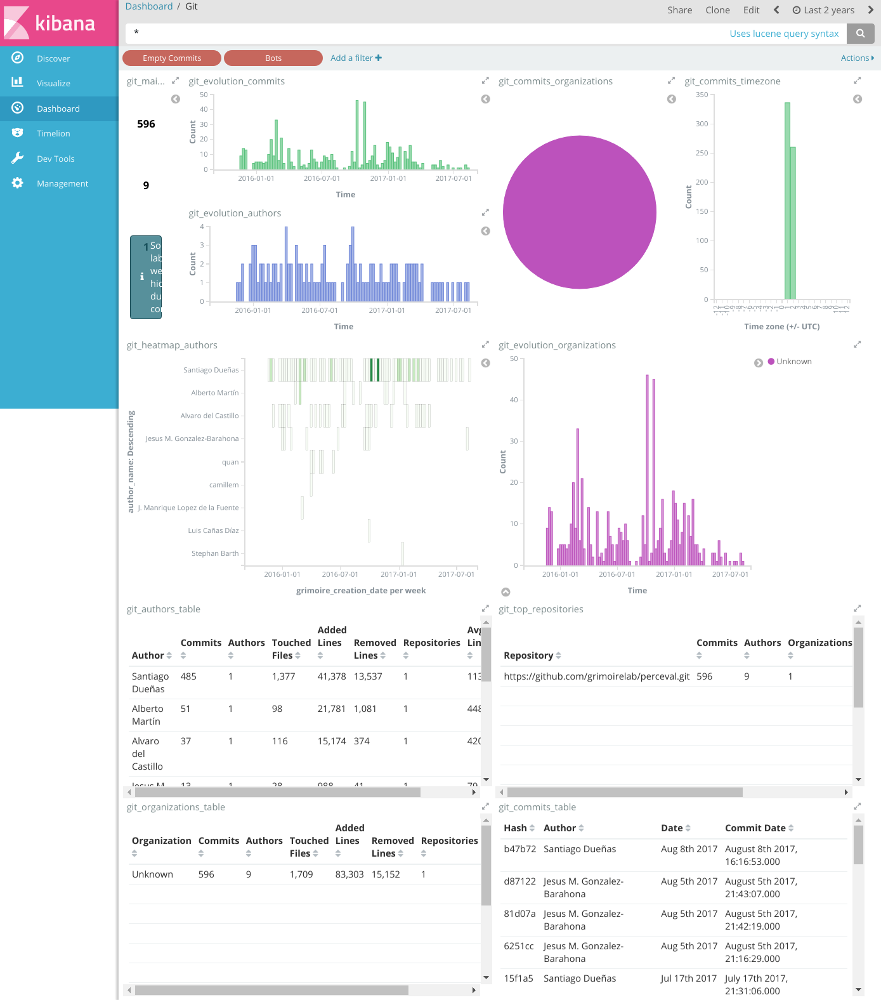

## A dashboard with SortingHat

The simple dashboard we just produced uses indexes which
do not benefit from [SortingHat](https://github.com/chaoss/grimoirelab-sortinghat),
because it was not used to produce them.
SortingHat is the GrimoireLab component that manages identities, allowing for merging of identities, definition of profiles for each person, and of periods of affiliation (when people worked for which organization).

SortingHat uses a MySQL-like database ([MySQL](https://www.mysql.com/) or [MariaDB](https://mariadb.org/), for example). Therefore, we will need to prepare the database we're going to use. Then, we will generate the indexes for the dashboard, but this time specifying the SortingHat database to use. That way, `p2o.py`, while generating the indexes, will inform SortingHat about new identities, and will get information about profiles, merged identities, etc, from it.

Of course, when running `p2o.py` for the first time on an empty SortingHat database, no merged identities or affiliations, and only default profiles will be available. So, we will need to do some stuff after getting the first version of the indexes, until we have the full power of SortingHat shown in our dashboard.

Let's go one step after the other...


### Initializing SortingHat

Before you can use SortingHat,
you need to initialize a database for it.
Usually, each dashboard will have its own SortingHat database, although several dashboards can share the same. Initializing the database means creating the SQL schema for it, initializing its tables, and not much more. But you don't need to know about the details: SortingHat will take care of that for you. Just run `sortinghat init` with the appropriate options:

```bash
(gl) $ sortinghat -u user -p XXX  init shdb
```

In this case, `user` is a user of the MySQL instance with permissions to create a new MySQL schema (database), `XXX` is the password for that user, and `shdb` is the name of the database to be created.

If the command didn't throw any error message, you're done: a new `shdb` database was created. If you want, you can check it with a simple `mysql` command:

```bash
$ mysql -u user -pXXX -e 'SHOW DATABASES;'
```

You should see `shdb` in the list of databases.

If for any reason you want to delete the database at some point, just run the appropriate mysql command:

```bash
$ mysql -u user -pXXX -e 'DROP DATABASE shdb;'
```

Now, with our shiny new database ready, you can create indexes with SortingHat support.

### Creating indexes

For creating the indexes, we run `p2o.py` the same way we have done before, but now specifying the SortingHat database to use. That will automatically trigger SortingHat to do its work. Of course, you need ElasticSearch (and Kibana or Kibitter, see below) running, but that can be done exactly the way we did for the simple dashboard.

For example, for producing the index for the git repository for Perceval, run:

```bash
(gl) $ p2o.py --enrich --index git_raw --index-enrich git \
  -e http://localhost:9200 --no_inc --debug \
  --db-host localhost --db-sortinghat shdb --db-user user --db-password XXX \
  git https://github.com/grimoirelab/perceval.git
...
2017-09-04 01:14:22,267 Total items enriched 688
2017-09-04 01:14:22,267 Done git
2017-09-04 01:14:22,268 Enrich backend completed
2017-09-04 01:14:22,268 Finished in 0.08 min
```

That means we have new `git_raw` and `git` indexes, but we also have a populated `shdb` database (assuming we have MySQL running in `localhost`, that is the machine where the script is run). If you want to check what's in it, you can again use `mysql`:

```bash
$ mysql -u user -pXXX -e 'SELECT * FROM identities;' shdb
```

This will show all the identities found in the Perceval git repository.

### Producing a Kibana dashboard

Let's produce now a Kibana dashboard for our enriched index (`git` in our ElasticSearch instance). I will start by installing `kidash`, to upload a JSON description of the dashboard, its visualizations, and everything needed:

```bash
(sh) $ pip install kidash
```

Then, I use the JSON description of a dashboard for Git that
includes visualizations for some fields generated from the SortingHat database: [git-sortinghat.json](dashboards/git-sortinghat.json).

```bash
(sh) $ kidash --elastic_url-enrich http://localhost:9200 \
  --import /tmp/git-sortinghat.json
```

(assuming you downloaded the file to `/tmp/git-sortinghat.json`)

And I get a dashboard in all its glory:



